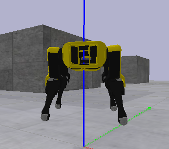
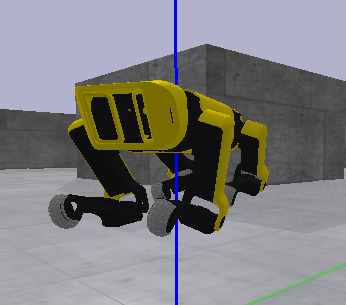
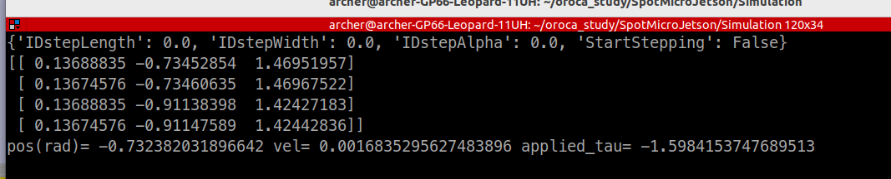

## Lp 값 변경을 통한 다리 벌려지는 각도 변경

원본

30추가 한 모습

### 변경한 코드
Lp = np.array([[iXf, -100, spurWidth+30, 1], [iXf, -100, -spurWidth-30, 1],
[-50, -100, spurWidth+30, 1], [-50, -100, -spurWidth-30, 1]])

- PyBullet API 마스터 (setJointMotorControl2, getJointState)
- SpotMicro 기본 자세(rest pose) 제어
- 시뮬레이션 루프 이해
- Rest pose에서 앉기/서기 동작 구현, 중력 보상 확인

spotmicroai.py 파일에서 로봇을 불러오는 것 같은데... 로봇과 관련된 urdf파일은 못찾음

    def loadModels(self):
        p.configureDebugVisualizer(p.COV_ENABLE_RENDERING, 0)
        p.setGravity(0, 0, -9.81)

        orn = p.getQuaternionFromEuler([math.pi/30*0, 0*math.pi/50, 0])
        p.setAdditionalSearchPath(pybullet_data.getDataPath())
        planeUid = p.loadURDF("plane_transparent.urdf", [0, 0, 0], orn)
        p.changeDynamics(planeUid, -1, lateralFriction=1)
        texUid = p.loadTexture("concrete.png")
        p.changeVisualShape(planeUid, -1, textureUniqueId=texUid)
        if self.useStairs:
            stairsUid = p.loadURDF("../urdf/stairs_gen.urdf.xml", [0, -1, 0], orn)
        flags=p.URDF_USE_SELF_COLLISION
        quadruped = p.loadURDF("../urdf/spotmicroai_gen.urdf.xml", self.init_position,
                            self.init_oritentation,
                            useFixedBase=self.useFixedBase,
                            useMaximalCoordinates=self.useMaximalCoordinates,
                            flags=flags) 
        p.configureDebugVisualizer(p.COV_ENABLE_RENDERING, 1)
        p.changeDynamics(quadruped, -1, lateralFriction=0.8)
       
중력 보상
