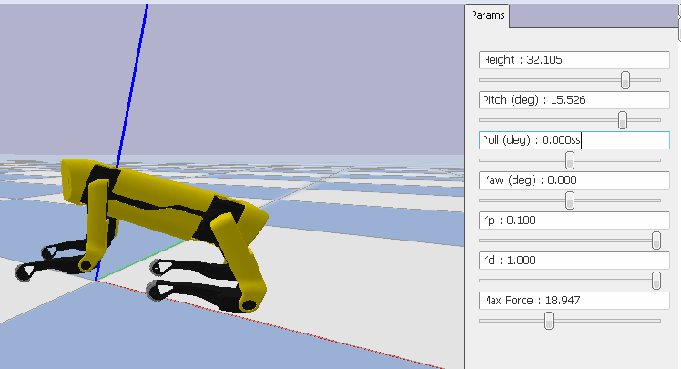
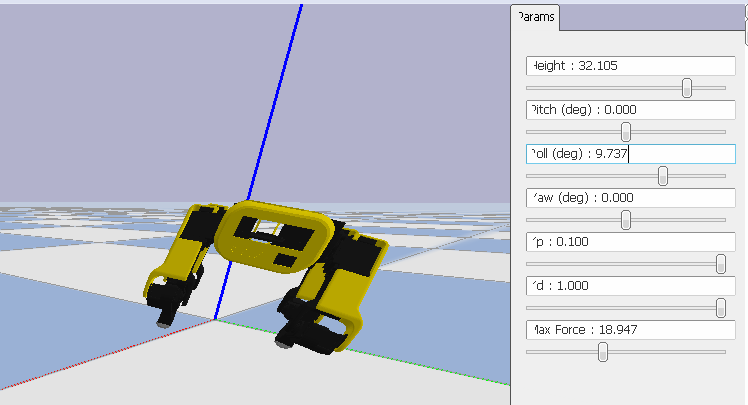
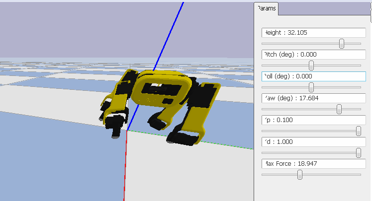
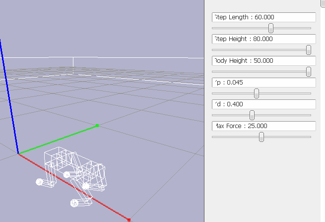
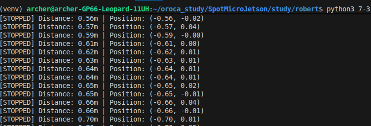

## 7주차 학습 목표

1. Body Height/Pitch/Roll 제어 원리 이해
2. CoM(Center of Mass) 추적 개념 학습
3. 전진 보행(Forward Walking) 구현
4. 좌우 회전 보행 구현


### 1. Body Height/Pitch/Roll 제어 원리 이해

[위치 3가지]                    [회전 3가지]
X: 앞뒤 이동                     Roll (φ):  좌우로 기울기 (옆으로 기울임)
Y: 상하 이동 (Height)            Pitch (θ): 전후로 기울기 (앞뒤로 기울임)
Z: 좌우 이동                     Yaw (ψ):   방향 회전 (고개 돌리기)

[Parameters 설명]

Body Height : 몸통의 높이(지면으로 부터)
Roll : x축 회전정도(앞 뒤로)

Pitch : Y축 회전 정도(옆)

Yaw : Z축 회전 (x-y좌표 평면상에서 방향 설정)


Kp : 강성값, 0이면 로봇이 점점 내려앉음
Kd : 댐핑 : 0이면 로봇의 다리가 떨림


### 2. CoM(Center of Mass) 추적 개념 학습

CoM(Center of Mass) : 로봇의 전체 질량의 중심점


### 3. 전진 보행(Forward Walking) 구현


#### w 키 눌러서 보행 하는경우



보행키를 누르지 않아도 Position 이 뒤로가는 현상 발생



- Kp, Kd값을 최대로 높여도 다리가 계속 움직임. 

[원인]

step_height가 조건과 상관없이 계속 적용

```python
        self.trotting.Sh = step_height
        
        if self.is_walking:
            kb_offset = {
                'IDstepLength': step_length,
                'IDstepWidth': 0.0,
                'IDstepAlpha': 0.0
            }
        else:
            # 정지 상태 - 기본 위치
            kb_offset = {
                'IDstepLength': 0.0,
                'IDstepWidth': 0.0,
                'IDstepAlpha': 0.0
            }
        
```

조건에 맞을 경우에는 trotting.Sh값이 step_height가 되도록
  
```python
        if self.is_walking:
            self.trotting.Sh = step_height
            kb_offset = {
                'IDstepLength': step_length,
                'IDstepWidth': 0.0,
                'IDstepAlpha': 0.0
            }
        else:
            # 정지 상태 - 기본 위치
            self.trotting.Sh = 0
            kb_offset = {
                'IDstepLength': 0.0,
                'IDstepWidth': 0.0,
                'IDstepAlpha': 0.0
            }
```

7-4.py도 동일한 이슈 해결, 7-3과 달리 w를 누르고 있어야 보행 진행

### 4. 다른 보행 구현

달리는 모션(Gallop) 구현


```python
 def positions(self, t, kb_offset):
        """
        시간 t에서의 4개 다리 발끝 위치 계산
        
        Returns:
        --------
        foot_positions : numpy array (4x4)
            각 다리의 [x, y, z, 1] 위치
            x: 앞뒤(전진), y: 높이(수직), z: 좌우
        """
        step_length = kb_offset.get('IDstepLength', 0.0)
        step_alpha = kb_offset.get('IDstepAlpha', 0.0)
        
        # 보행 주기 계산
        phase = (t % self.period) / self.period  # 0~1 반복
        
        foot_positions = np.copy(self.default_stance)
        
        # 각 다리의 궤적 계산
        for leg_idx in range(4):
            # 앞다리(0,1) vs 뒷다리(2,3) 구분
            if leg_idx < 2:  # Front legs (FL, FR)
                leg_phase = phase
            else:  # Rear legs (RL, RR)
                leg_phase = (phase + 0.5) % 1.0  # 0.5 뒤쳐짐
            
            # 타원 궤적 계산
            x_offset, y_offset = self._compute_trajectory(
                leg_phase, 
                step_length,
                self.Sh
            )
            
            # 회전 적용
            if step_alpha != 0:
                # 앞다리는 바깥쪽, 뒷다리는 안쪽으로
                if leg_idx < 2:  # 앞다리
                    x_offset += step_alpha * 0.5
                else:  # 뒷다리
                    x_offset -= step_alpha * 0.5
            
            # ★ 핵심 수정: 좌표계 올바르게 적용 ★
            foot_positions[leg_idx][0] += x_offset  # X축: 앞뒤 이동
            foot_positions[leg_idx][1] += y_offset  # Y축: 높이 변화 (수정!)
            # Z축 (foot_positions[leg_idx][2])은 좌우이므로 건드리지 않음
        
        return foot_positions
    
    def _compute_trajectory(self, phase, step_length, step_height):
        """
        단일 다리의 타원 궤적 계산
        
        Returns:
        --------
        x_offset : float
            앞뒤 방향 오프셋 (전진 방향)
        y_offset : float
            높이 방향 오프셋 (수직 방향)
        """
        if phase < 0.5:
            # Swing Phase (공중): 발을 앞으로 이동
            swing_progress = phase / 0.5  # 0~1
            
            # X축: -step_length/2 → +step_length/2 (앞으로)
            x_offset = -step_length/2 + step_length * swing_progress
            
            # Y축: 포물선 (0 → step_height → 0) - 수직 위로!
            y_offset = step_height * math.sin(swing_progress * math.pi)
            
        else:
            # Stance Phase (지면): 발로 지면을 뒤로 밀기
            stance_progress = (phase - 0.5) / 0.5  # 0~1
            
            # X축: +step_length/2 → -step_length/2 (뒤로)
            x_offset = step_length/2 - step_length * stance_progress
            
            # Y축: 지면 접촉 (높이 0)
            y_offset = 0.0
```

그러나 앞다리가 공중으로 이동을 안하는 이슈 발생..