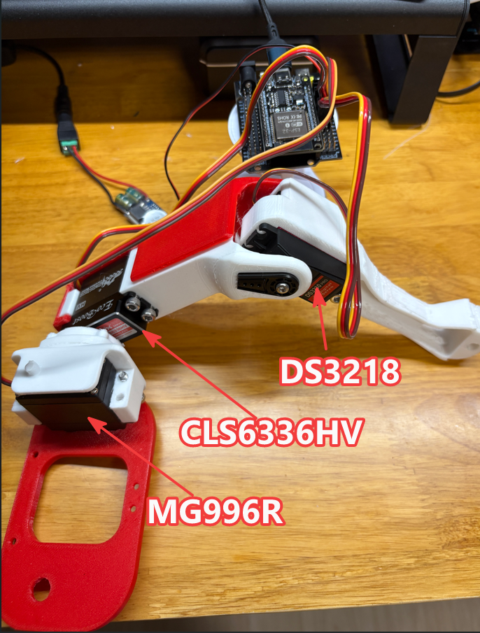

# SpotMicro Week 02 — 오른쪽 다리 조립 & 시뮬레이션 분석

> 작성일: 2026-06-13

---

## 1. 오른쪽 다리 조립

### 1.1 조립 사진

### 1.2 서보 배치

| 위치 | 모델 | 이유 |
|------|------|------|
| 본체 roll 관절 | MG996R | 해당 축은 부하가 상대적으로 낮아 저토크 모델 배치 |
| 본체–다리 관절 | CLS6336HV | 하중이 가장 많이 인가되는 위치 → 한양대 Road Balance팀 적용 모델 사용 |
| 다리–발 관절 | DS3218 | CLS6336HV 대체품 테스트 (커뮤니티 가성비 추천 모델) |

### 1.3 서보 선정 배경

한양대 Road Balance팀 기준으로는 전 관절에 **CLS6336HV**를 사용하는 것이 정석이지만, 개당 ₩49,000으로 12개 합계 ₩588,000에 달하는 고가이다.

이를 고려해 대체 구성을 테스트했다:

- **MG996R**: 토크가 약해(11 kg·cm @ 6V) 본체의 roll 동작처럼 부하가 작은 축에만 제한적으로 사용
- **CLS6336HV**: 코어리스 DC + CNC 알루미늄 기어, 35.6 kg·cm @ 7.4V — 가장 부하가 큰 본체–다리 관절에 사용
- **DS3218**: 커뮤니티에서 CLS6336HV 대체품으로 많이 추천되는 모델(28.5 kg·cm @ 5V, ₩15,000) — 다리–발 관절에서 테스트

---

## 2. 동작 테스트

### 2.1 테스트 영상

<video src="images/w02_RightLeg_Test.mp4" controls width="100%"></video>

각 서보의 동작 범위(0° → 180° → 90°) 및 정지점 확인 테스트를 수행했으며, **정상 동작을 확인**했다.

### 2.2 제어 하드웨어

- **MCU**: ESP32 DevKit

### 2.3 소스 코드

[src/test_motor.cpp](src/test_motor.cpp)

시리얼 명령어로 채널별 서보를 개별 테스트하는 코드이다. 주요 명령어:

| 명령어 | 동작 |
|--------|------|
| `aa` / `af` | 채널 A arm/foot 순차 테스트 (90→0→180→90) |
| `aa90` / `df45` | 채널+타입+각도 직접 지정 이동 |
| `on` / `off` | 전체 서보 켜기(90도) / 끄기 |

---

## 3. PyBullet 시뮬레이션

### 3.1 시뮬레이션 결과 영상

<video src="images/w02_pybullet_sim.mp4" controls width="100%"></video>

### 3.2 분석 문서

시뮬레이션 전체 구조 및 보행 알고리즘 분석은 별도 문서로 정리했다.

→ [work02_SIMULATION_ANALYSIS.md](work02_SIMULATION_ANALYSIS.md)

주요 분석 내용:

| 항목 | 내용 |
|------|------|
| 시뮬레이터 | PyBullet (550Hz 고정 스텝) |
| 보행 패턴 | Trotting Gait — 대각선 페어(FR+RL / FL+RR) 교대 |
| 역기구학 | 기하학적 방법 (legIK: θ1, θ2, θ3) |
| 제어 | POSITION_CONTROL, 12관절 (4다리 × 3관절) |
| 입력 | 멀티프로세스 키보드 (w/a/s/d/q/e/space) |

---

## 4. 다음 주 계획

1. **본체 회로부 조립** — PCA9685, UBEC, 배터리 배선 구성
2. **Jetson Nano → RPi5 포팅 스터디** — 스터디에서 Jetson Nano 버전 코드를 Raspberry Pi 5 환경에 어떻게 포팅할지 분석
