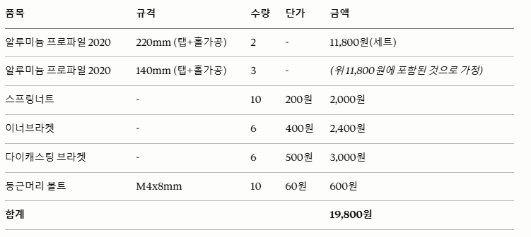
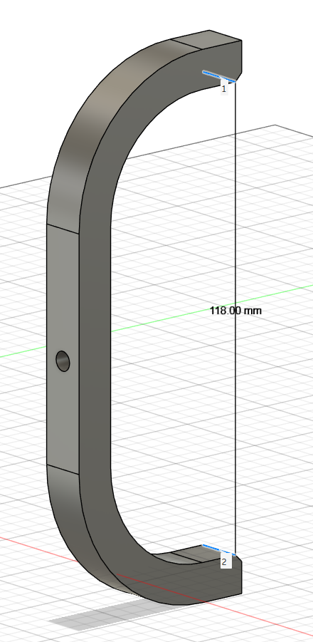
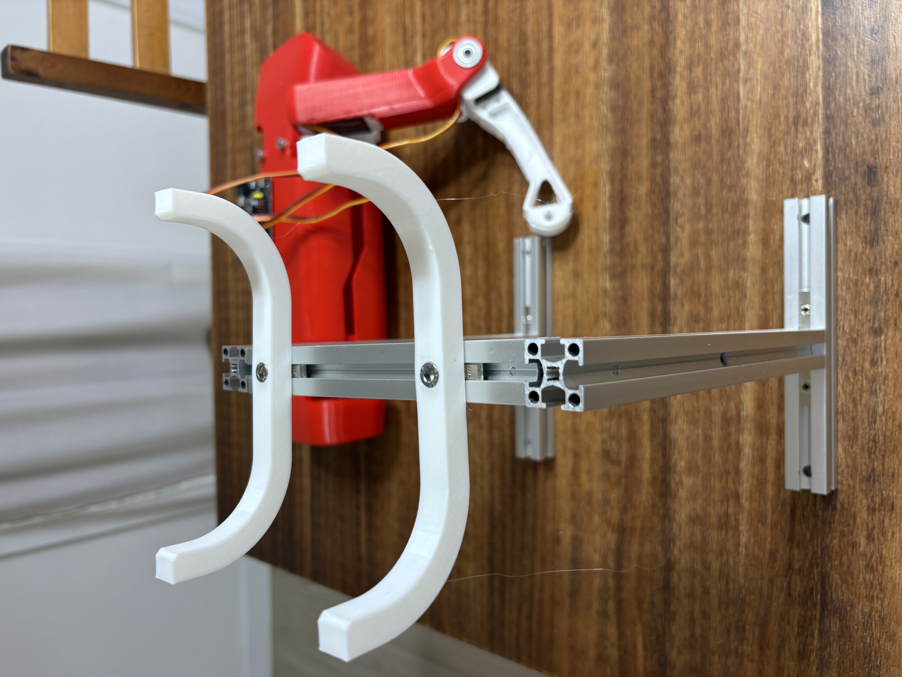
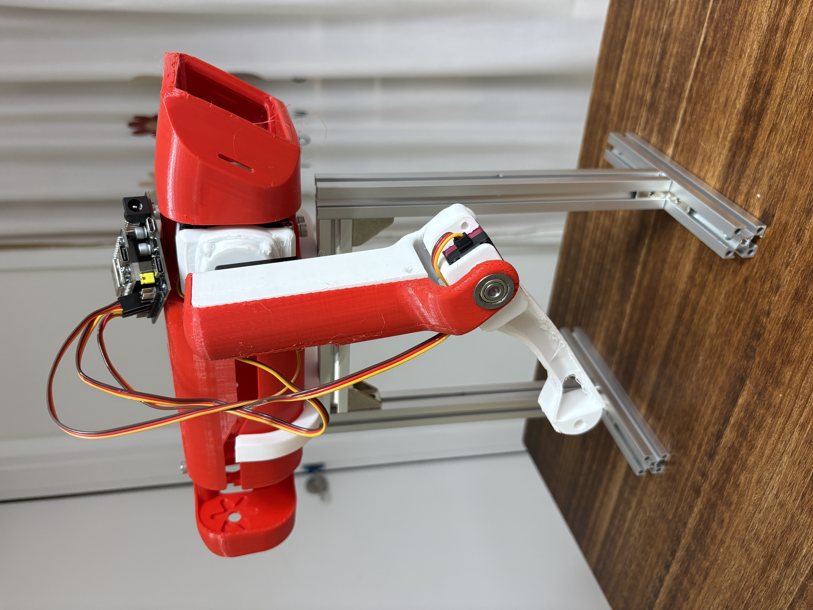
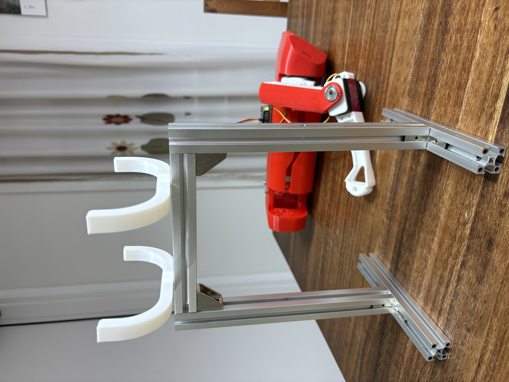
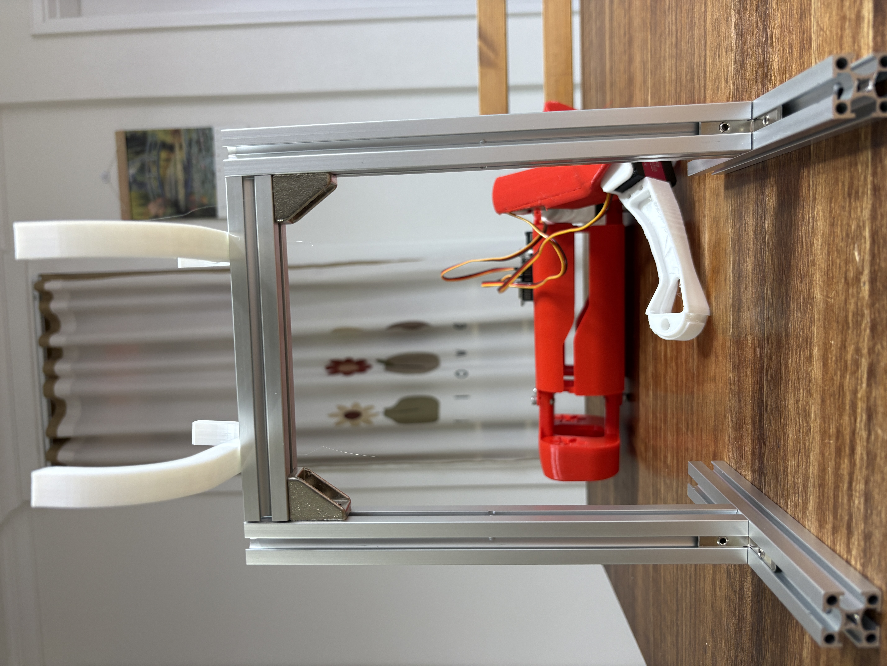

# SpotMicro Week 04 — SpotMicro 거치대 제작

> 작성일: 2026-07-02

---

## 1. 개요

SpotMicro 본체를 공중에 띄운 상태로 고정하기 위한 거치대를 제작했다.
다리가 자유롭게 움직일 수 있도록 본체(body)만 지지하는 구조이며, 서보 테스트 및 보행 알고리즘 개발 시 로봇이 넘어지지 않도록 고정하는 용도로 사용한다.

---

## 2. BOM (부품 목록)

### 2.1 알루미늄 프로파일

| 부품 | 규격 | 수량 |
|------|------|------|
| 2020 V-Slot 알루미늄 프로파일 | 20×20mm | BOM 참고  |
| 연결 브라켓 | 2020용 |  BOM 참고 |
| M5 T-너트 + 볼트 | - | BOM 참고 |

- 구매처: [스마트스토어 — 알루미늄 프로파일](https://smartstore.naver.com/smartprofile/products/3012931030?NaPm=ct%3Dmr29sjcg%7Cci%3Dcheckout%7Ctr%3Dppc%7Ctrx%3Dnull%7Chk%3Dd6d1c5cbdd1ad5df9f712122b8f922fe23d53dcd)

### 2.2 3D 프린팅 부품

| 파일 | 용도 | 소재 | 출력 시간 |
|------|------|------|-----------|
| `Spot_Stand.stl` | body 지지 클램프 | PLA | 약 1시간 26분 |

---

## 3. 설계 도면

- Body 양쪽을 잡아주는 클램프 형태
- 알루미늄 프로파일에 M5 볼트로 고정
- SpotMicro body 너비에 맞춰 설계

---

## 4. STL 파일

| 파일 | 경로 |
|------|------|
| Body 지지대 | [`stl/Spot_Stand.stl`](stl/Spot_Stand.stl) |

슬라이서 설정 (PrusaSlicer 기준):
- 레이어 높이: 0.2mm
- 인필: 20%
- 서포트: 없음

---

## 5. 완성 사진

| | |
|---|---|
|  |  |
|  |  |

---

## 6. 비고

- 거치대에 고정된 상태에서 서보 동작 및 보행 패턴 테스트 진행
- 알루미늄 프로파일 높이를 조절하면 다리 접지 높이 변경 가능
