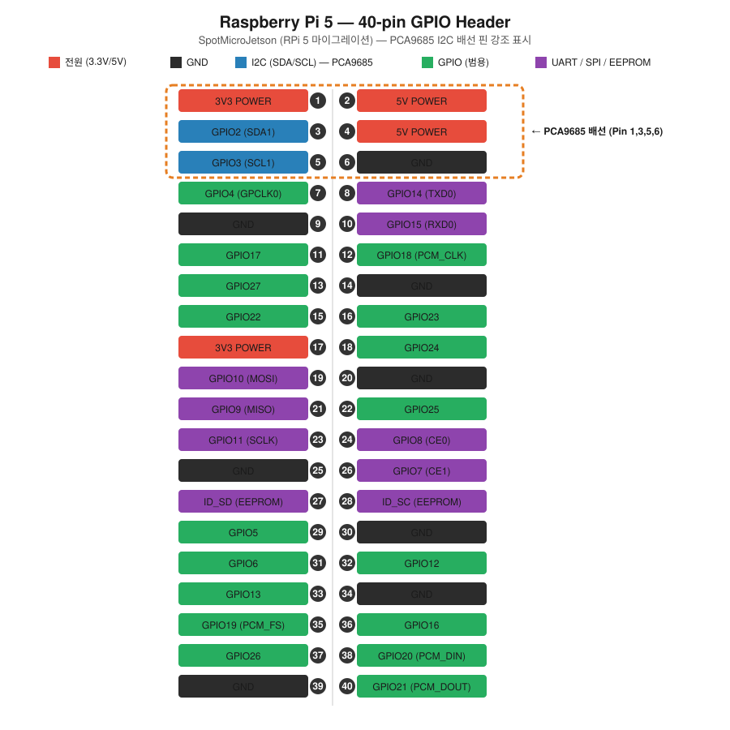

# SpotMicro Week 05 — Jetson Nano → Raspberry Pi 5 마이그레이션

> 작성일: 2026-07-09

---

## 1. H/W 비교: Jetson Nano vs Raspberry Pi 5

| 항목 | Jetson Nano B01 | Raspberry Pi 5 8GB |
|------|-----------------|-------------------|
| CPU | Cortex-A57 × 4 @ 1.43GHz | **Cortex-A76 × 4 @ 2.4GHz** |
| RAM | 4GB LPDDR4 | **8GB LPDDR4X** |
| GPU / AI | 128-core Maxwell (CUDA) | VideoCore VII (AI 없음) |
| Storage | microSD / eMMC | microSD + **NVMe (PCIe 2.0)** |
| GPIO | 40-pin (J41) | 40-pin (호환) |
| I2C | bus 0, 1 (SCL_1, SDA_1) | I2C1 (SCL, SDA) |
| USB | USB 3.0 × 4 | USB 3.0 × 2, USB 2.0 × 2 |
| 전원 입력 | 5V/4A DC Barrel | **5V/5A USB-C PD** |
| 가격 | ~$150–200 (단종) | **~$120** |
| OS | Ubuntu + JetPack | Raspberry Pi OS |

**결론:**
- CPU/RAM 성능은 RPi 5가 우수
- AI 추론(CUDA)은 Jetson이 유리하나, **Isaac Lab 강화학습 policy.pt는 CPU에서 추론 가능** → CUDA 불필요 (아래 설명)
- 가격, 구매 용이성, 커뮤니티 지원 모두 RPi 5가 유리

---

## 2. 핀맵 비교 (40-pin GPIO)

SpotMicro에서 사용하는 주요 핀은 **I2C** (PCA9685, MPU6050 연결)뿐이다.

> 참고: `requirements.txt`에 `Adafruit-SSD1306`(OLED 디스플레이) 의존성과 `legacy/boot.py`의 `RobotDisplay` 참조가 남아있지만 전부 주석 처리된 죽은 코드이며, 현재 활성 코드(`spotmicroai.py`, `servo_controller.py`)에서는 사용하지 않는다. `spotmicroai.py`의 카메라/라이다 관련 변수도 PyBullet 시뮬레이션 전용 값이라 실물 배선과 무관하다.

### RPi 5 전체 핀맵 (40-pin)



주황 점선으로 표시된 Pin 1/3/5/6이 SpotMicro에서 실제로 쓰는 PCA9685 I2C 배선 핀이다. 나머지 GPIO/SPI/UART 핀은 이번 마이그레이션에서 사용하지 않는다.

| 물리 핀 | Jetson Nano (J41) | RPi 5 | 용도 |
|---------|-------------------|-------|------|
| Pin 1 | 3.3V | 3.3V | PCA9685 VCC |
| Pin 3 | SDA_1 (GPIO3) | SDA1 (GPIO2) | I2C Data |
| Pin 5 | SCL_1 (GPIO5) | SCL1 (GPIO3) | I2C Clock |
| Pin 6 | GND | GND | GND |

→ **물리 핀 위치가 동일** — 기존 배선 그대로 사용 가능

### 연결도

[Cirkit Designer — SpotMicro RPi 5 연결도](https://app.cirkitdesigner.com/project/831f0835-5052-4e85-9442-0e19f2be4248)

### PCA9685 연결 (서보 드라이버)

```
RPi 5 Pin 1  (3.3V)  → PCA9685 VCC
RPi 5 Pin 3  (SDA1)  → PCA9685 SDA
RPi 5 Pin 5  (SCL1)  → PCA9685 SCL
RPi 5 Pin 6  (GND)   → PCA9685 GND
```

- PCA9685 #1: I2C 주소 0x40 (서보 0~11, 앞 2다리)
- PCA9685 #2: I2C 주소 0x41 (서보 0~11, 뒤 2다리)

※ PCA9685의 V+ (서보 전원)는 RPi에서 공급하지 않음 → 별도 전원 필요 (아래 전원 설계 참고)

---

## 3. 전원 설계

### 3.1 전원 구성

```
배터리 (7.4V LiPo 2S)
    │
    ├── BEC/UBEC (6V 출력, 5A+)
    │       └── PCA9685 V+ → 서보 12개 (6V)
    │
    └── DC-DC (5V 출력, 5A)
            └── RPi 5 USB-C PD 입력 (5V/5A)
```

### 3.2 서보 전원 계산

| 항목 | 값 |
|------|-----|
| 서보 1개 동작 전류 | ~500mA (피크) |
| 서보 수 | 12개 |
| 동시 동작 가정 | 최대 6개 동시 |
| 필요 전류 | 6 × 500mA = **3A 이상** |
| 권장 UBEC | **5A 이상** (여유 고려) |

### 3.3 주의사항

- **서보 전원을 RPi GPIO 핀(5V Pin 2/4)에서 직접 공급하지 말 것** → RPi 손상 위험
- PCA9685 VCC(3.3V)와 V+(서보 6V)는 분리
- GND는 RPi와 PCA9685, 배터리가 모두 공통 GND 연결 필수

---

## 4. 라이브러리 선택: Python vs Arduino

### 4.1 기존 코드 분석

```python
# JetsonNano/servo_controller.py
from adafruit_servokit import ServoKit
import busio, board

i2c_bus0 = busio.I2C(board.SCL_1, board.SDA_1)   # ← Jetson Nano 핀
kit = ServoKit(channels=16, i2c=i2c_bus0, address=0x40)
```

### 4.2 RPi 5 변경사항 (1줄만 수정)

```python
# RPi 5 — board.SCL_1 → board.SCL 로만 변경
i2c_bus0 = busio.I2C(board.SCL, board.SDA)
kit = ServoKit(channels=16, i2c=i2c_bus0, address=0x40)
```

**나머지 코드는 변경 없음** — adafruit_servokit은 Jetson Nano, RPi 모두 동일하게 동작함

### 4.3 Python vs Arduino 비교

| 항목 | Python (RPi) | Arduino (ESP32) |
|------|-------------|-----------------|
| 기존 SpotMicro 코드 재사용 | ✅ 90% 그대로 | ❌ 전면 재작성 필요 |
| adafruit_servokit 사용 | ✅ pip install | ❌ 별도 라이브러리 |
| NumPy (역기구학 계산) | ✅ 기본 지원 | ❌ 제한적 |
| 멀티프로세싱 / 스레딩 | ✅ multiprocessing | ❌ FreeRTOS 필요 |
| 디버깅 / 개발 편의성 | ✅ REPL, print | ⚠️ Serial Monitor |
| 실시간성 | ⚠️ OS 스케줄링 영향 | ✅ 정확한 타이밍 |
| 속도 | ⚠️ 인터프리터 | ✅ 컴파일 |

### 4.4 결론 — RPi 5는 Python 권장

RPi는 Linux OS 위에서 동작하므로 Arduino 코드를 직접 실행할 수 없다.
Arduino 방식으로 하려면 RPi ↔ Arduino(or ESP32) 직렬 통신 구조가 필요해 복잡해진다.

**권장 구조:**
```
RPi 5 (Python)
  └── adafruit_servokit → PCA9685 (I2C) → 서보 12개
  └── mpu6050 라이브러리 → MPU6050 (I2C) → IMU
  └── 기존 kinematics.py, gait.py 재사용
```

---

## 4.5 ROS 사용 여부 정리 (RPi 5 이식 시 참고)

레포 전체를 검색한 결과, `package.xml`/`CMakeLists.txt`에 `roscpp`/`rospy` 의존성이 선언되어 있지만 **실제 코드에서 `rospy`/`roscpp` API를 사용하는 곳은 없다.** RPi 5로 옮길 때 ROS 관련 설치/설정은 신경 쓸 필요 없다는 뜻.

**ROS를 사용하는 부분 (URDF/RViz 시각화 전용 골격)**

| 위치 | 내용 |
|------|------|
| `package.xml`, `CMakeLists.txt` | catkin 패키지 `spotmicroai` 선언, 의존성만 명시된 보일러플레이트 (노드/메시지 없음) |
| `urdf/gen_urdf.sh` | xacro → URDF 생성 |
| `urdf/create_ros_urdf.sh` | STL 경로를 `package://spotmicroai/urdf/stl/...` 형식으로 치환 (RViz용) |

→ `roslaunch` 파일이나 ROS 노드 소스(`src/`, `scripts/`)는 레포에 없음. RViz로 URDF만 띄워보는 용도.

**ROS를 사용하지 않는 부분 (실제 제어/시뮬레이션/연구 코드 전부)**

| 위치 | 내용 |
|------|------|
| `JetsonNano/` | `adafruit_servokit`으로 PCA9685 I2C 직접 제어 |
| `Kinematics/` | numpy 기반 역기구학 |
| `Simulation/` | PyBullet 물리 시뮬레이션 + gym 환경 |
| `study/minho/` (work01~05) | 서보 비교, 조립, ESP32 서보 테스트, Isaac Sim/Lab RL 훈련, RPi5 포팅 |

**결론:** 로봇 제어·시뮬레이션·RL 파이프라인은 전부 ROS 바깥(순수 Python/PyBullet/Isaac Lab/adafruit)에서 동작하므로, RPi 5 이식 시 ROS 설치는 불필요하다.

---

## 5. Isaac Lab 강화학습 policy.pt — CUDA 없이 RPi 5에서 실행 가능한가?

**결론: 가능하다.** CUDA(GPU)는 학습 단계에서만 필요하다. RPi 5에서는 CPU 추론만으로 충분하다.

### 5.1 학습 vs 추론의 차이

| 단계 | 수행 장소 | CUDA 필요 여부 | 이유 |
|------|-----------|---------------|------|
| 학습 (Training) | PC / 서버 (Isaac Lab) | ✅ 필요 | 수천 개 병렬 환경 × 수백만 스텝 시뮬레이션 |
| 추론 (Inference) | RPi 5 (배포) | ❌ 불필요 | 단일 forward pass만 수행 |

### 5.2 추론 연산량

Isaac Lab RSL-RL로 학습한 SpotMicro 정책 네트워크 구조:

```
입력 (관측값): ~48차원
  → Linear(48 → 256) → ELU
  → Linear(256 → 128) → ELU
  → Linear(128 → 64)  → ELU
  → Linear(64 → 12)   (출력: 서보 12개 목표각)
```

- 파라미터 수: 약 50,000개 (매우 작음)
- 실행 주기: 50Hz (20ms 마다 1회)
- 1회 forward pass 소요 시간 (RPi 5 CPU): **< 1ms**

→ RPi 5 Cortex-A76 @ 2.4GHz에서 실시간 실행에 전혀 문제없음

### 5.3 RPi 5에서 실행 방법

```python
import torch

# CPU로 명시 로드 (CUDA 없어도 동작)
policy = torch.jit.load("policy.pt", map_location="cpu")
policy.eval()

obs = torch.tensor(observation, dtype=torch.float32)  # shape: [1, 48]
with torch.no_grad():
    action = policy(obs)  # shape: [1, 12]
```

PyTorch CPU 버전(`pip install torch --index-url https://download.pytorch.org/whl/cpu`)만 설치하면 된다. CUDA 드라이버 불필요.

---

## 6. 다음 단계

- [ ] RPi 5에 Raspberry Pi OS 설치
- [ ] I2C 활성화 및 PCA9685 연결 확인
- [ ] `servo_controller.py` 핀 이름 수정 후 서보 동작 테스트
- [ ] MPU6050 연결 및 데이터 확인
- [ ] 보행 알고리즘 실행 테스트
