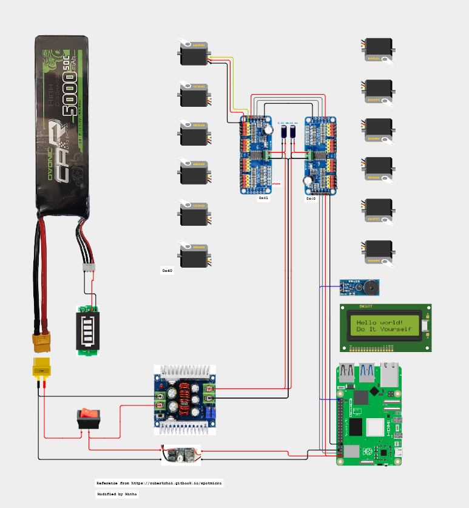

# SpotMicro Week 08 — 전원 설계 변경 & PCA9685 데이지 체인

> 작성일: 2026-08-09

---

## 1. 배경

work07.md에서 RPi 5 OS 설치와 NVMe 부팅까지 완료한 뒤, 실제 로봇 통합 배선 단계에서 두 가지 설계 변경이 발생했다.

1. **전원 계통 단순화** — 2단 벅 변환 구조가 RPi 5 부팅을 방해하는 문제 발견 → 1단 구조로 변경
2. **PCA9685 배선 변경** — RPi 3.3V 핀에서 두 PCA9685로 병렬 공급하던 방식을 데이지 체인(daisy chain)으로 변경

전체 최신 배선도는 아래 이미지와 Cirkit Designer 프로젝트에서 확인할 수 있다.



[Cirkit Designer — SpotMicro 최신 배선도](https://app.cirkitdesigner.com/project/831f0835-5052-4e85-9442-0e19f2be4248)

---

## 2. 전원 설계 변경

### 2.1 기존 설계 (문제 발생)

```
[LiPo 11.1V] → [300W 20A Buck (XL4016)] → 5V/4A → [RPi 5 GPIO Pin 2/4]
```

**증상**: RPi 5의 빨간 LED(3.3V 레일)는 켜졌지만, 초록 LED(부팅 매체 접근)가 뜨지 않아 부팅 실패.

**원인 분석** (work07.md 이후 검증):

| 원인 | 설명 |
|------|------|
| **소프트 스타트 지연** | XL4016 기반 300W buck은 대용량 출력 캡(1000µF+) 때문에 출력이 200~500ms에 걸쳐 서서히 상승. RPi 5 PMIC(DA9091)는 300ms 내에 4.75V 이상 안정화를 요구하기 때문에 부팅 시퀀스 중단 |
| **느린 과도응답** | XL4016 스위칭 주파수 180kHz로 낮아, RPi 5 부팅 초기의 순간 인러시(2~3A, µs 단위)를 못 따라감. 무부하 5V 측정값과 무관하게 부하 걸리면 4V대로 sag |
| **스펙 부풀리기** | "20A" 표기는 순간 피크값이며 지속 정격은 5~8A. RPi 5용 로직 전원으로 부적합 |

### 2.2 변경 후 설계 (정상 부팅 확인)

```
[LiPo 11.1V] ─┬─→ [UBEC 5V/3A (or XL4015)] → RPi 5 GPIO Pin 2/4  ← 로직 전원
              │
              └─→ [300W Buck 7.4V]           → 서보 12개          ← 파워 전원
                                              (PCA9685 V+ 입력)
```

**핵심 원칙**: 로직 전원과 서보 전원을 분리하고, **GND만 공통**으로 연결.

- **로직 전원**: UBEC(Switching BEC) 또는 XL4015 → 응답 빠르고 노이즈 낮음 → RPi 5 PMIC 요구사항 충족
- **파워 전원**: 300W buck은 원래 대전류 지속 부하용 → 서보 12개 병렬 구동에 적합
- **분리 효과**: 서보 구동 시 발생하는 스파이크 노이즈가 RPi 로직으로 전파되지 않음

### 2.3 검증 결과

| 구성 | RPi 5 부팅 |
|------|------------|
| 12V 어댑터 → 300W Buck → XL4015 → RPi 5 (2단 종속) | ❌ 부팅 실패 |
| 12V 어댑터 → XL4015 → RPi 5 (1단) | ✅ 정상 부팅 |
| 12V 어댑터 → UBEC 5V/3A → RPi 5 (1단) | ✅ 정상 부팅 |

**결론**: 벅 컨버터를 종속(cascade)으로 연결하면 두 컨버터의 피드백 루프가 간섭하고 소프트 스타트 지연이 누적되어 RPi 5 PMIC 부팅 요구사항을 만족 못함. 1단 구조가 필수.

---

## 3. PCA9685 배선 변경 (데이지 체인)

### 3.1 기존 설계 — 병렬 배선

```
             ┌─→ PCA9685 #1 (0x40)
RPi 5 Pin 1 ─┤
(3.3V)       └─→ PCA9685 #2 (0x41)

             ┌─→ PCA9685 #1
RPi 5 Pin 3 ─┤   (SDA)
(SDA)        └─→ PCA9685 #2

             ┌─→ PCA9685 #1
RPi 5 Pin 5 ─┤   (SCL)
(SCL)        └─→ PCA9685 #2
```

- RPi GPIO에서 두 갈래로 나눠 각 PCA9685에 개별 공급
- 배선이 복잡하고 커넥터/점퍼선 접점이 늘어남

### 3.2 변경 후 — 데이지 체인

```
RPi 5 → PCA9685 #1 (0x40) → PCA9685 #2 (0x41)
        ├ VCC        →  VCC
        ├ GND        →  GND
        ├ SDA        →  SDA
        └ SCL        →  SCL
```

- RPi에서 PCA9685 #1으로만 배선
- PCA9685 #1의 출력 헤더에서 PCA9685 #2로 체인 연결
- PCA9685 보드는 좌/우 양쪽에 동일한 4핀(VCC/GND/SDA/SCL) 헤더가 있어 데이지 체인 지원

**장점**:
- RPi 측 배선이 단순화 (분기 커넥터 불필요)
- I2C 버스는 원래 다중 슬레이브 지원이므로 전기적으로 문제 없음
- 두 보드가 물리적으로 인접 배치되면 배선 길이 최소화

### 3.3 두 번째 PCA9685의 주소 설정 (0x41)

PCA9685는 보드의 **A0~A5 점퍼 패드**로 I2C 주소를 설정한다. 기본 주소는 `0x40`이고, 점퍼를 납땜(High)하면 해당 비트가 1이 된다.

| A0 | A1 | A2 | A3 | A4 | A5 | 주소 |
|----|----|----|----|----|----|------|
| 0  | 0  | 0  | 0  | 0  | 0  | 0x40 (기본) |
| **1**  | 0  | 0  | 0  | 0  | 0  | **0x41** (두 번째 보드) |

→ **두 번째 PCA9685의 A0 패드를 납땜(High)** 하여 주소를 `0x41`로 설정.

### 3.4 코드와의 대응

`JetsonNano/servo_controller.py`에서:
```python
self._kit  = ServoKit(channels=16, i2c=self._i2c_bus0, address=0x40)  # 앞다리
self._kit2 = ServoKit(channels=16, i2c=self._i2c_bus0, address=0x41)  # 뒷다리
```
- 채널 0~5: `_kit` (0x40) → FL/FR 다리
- 채널 6~11: `_kit2` (0x41) → RL/RR 다리

### 3.5 테스트 확인

```bash
i2cdetect -y 1
```
```
     0  1  2  3  4  5  6  7  8  9  a  b  c  d  e  f
40: 40 41 -- -- -- -- -- -- -- -- -- -- -- -- -- --
70: 70 71 -- -- -- -- -- -- -- -- -- -- -- -- -- --
```
- `0x40`, `0x41` 두 PCA9685 모두 검출
- `0x70`, `0x71`은 각 PCA9685의 All-Call 주소 (자동 응답, 정상)
- `test_servos_cali.py`로 채널 0~11 개별 동작 확인 완료

---

## 4. 관련 파일 & 참고

| 파일/링크 | 역할 |
|-----------|------|
| `study/minho/images/diagram_v1.0.png` | 최신 전체 배선도 |
| [Cirkit Designer 프로젝트](https://app.cirkitdesigner.com/project/831f0835-5052-4e85-9442-0e19f2be4248) | 온라인 배선도 편집본 |
| `JetsonNano/servo_controller.py` | PCA9685 두 개 초기화 (`0x40`, `0x41`) |
| `JetsonNano/examples/test_servos_cali.py` | 서보 채널별 동작 검증 |
| `study/minho/work05.md` | RPi 5 마이그레이션 하드웨어 비교 |
| `study/minho/work06.md` | 서보 조립/오프셋 정리 |
| `study/minho/work07.md` | RPi 5 OS 설치 & NVMe 부팅 |

---

## 5. 다음 단계

- [ ] 로봇 실장 상태에서 12개 서보 전부 구동 시 UBEC 5V 라인 sag 여부 측정
- [ ] MPU6050 연결 및 데이터 확인
- [ ] `spotmicroai.py` 실행 → 실물 보행 알고리즘 테스트
- [ ] 배터리 지속시간 실측 (LiPo 11.1V 5200mAh 기준)
