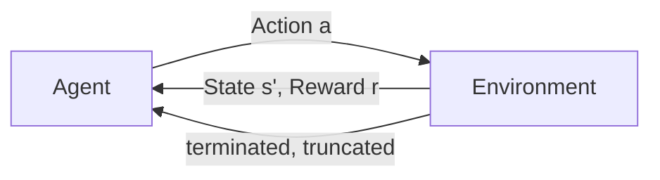
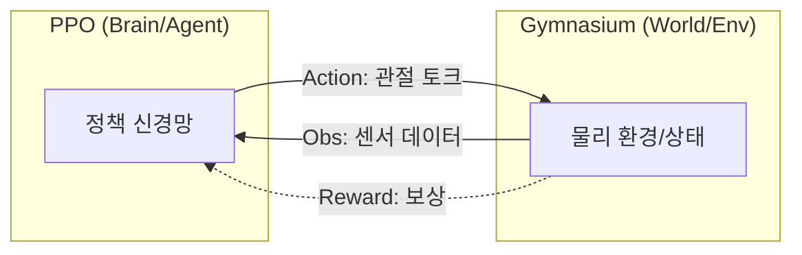

# Week 09: Gymnasium 환경 래핑 및 PPO 강화학습

이번 주차에는 **강화학습(RL)**을 위한 환경 구성과 **PPO (Proximal Policy Optimization)** 알고리즘을 이용한 학습 파이프라인을 구축합니다. 또한 효과적인 학습을 위한 **Reward Shaping** 기법을 학습합니다.

---

## 1. Gymnasium 환경 래핑

### 1.1 Gymnasium이란?

**Gymnasium**은 OpenAI Gym의 공식 후속 프로젝트로, **Farama Foundation**에서 관리합니다. 강화학습 알고리즘 개발 및 벤치마킹을 위한 **표준 API**를 제공하며, 다양한 RL 라이브러리와 호환됩니다.

```bash
# 설치
pip install gymnasium
# 또는 uv 사용
uv add gymnasium

# 추가 환경 설치 (선택사항)
pip install gymnasium[mujoco]    # MuJoCo 환경
pip install gymnasium[atari]     # Atari 게임
pip install gymnasium[box2d]     # Box2D 물리 환경
```

**Gymnasium vs OpenAI Gym:**

| 비교 항목 | OpenAI Gym | Gymnasium |
| :--- | :--- | :--- |
| **관리 주체** | OpenAI (지원 중단) | Farama Foundation |
| **버전** | 0.26.x (마지막) | 1.0+ (활발한 개발) |
| **API 버전** | Old API / New API 혼재 | New API 전용 |
| **step() 반환값** | `(obs, reward, done, info)` | `(obs, reward, terminated, truncated, info)` |
| **호환성** | 레거시 코드 많음 | 최신 RL 라이브러리 지원 |

> [!NOTE]
> 2022년 OpenAI는 Gym의 유지보수를 중단하고, Farama Foundation에 프로젝트를 이관했습니다. **새 프로젝트는 반드시 Gymnasium을 사용**하세요.

### 1.2 강화학습 기본 개념

Gymnasium은 **MDP (Markov Decision Process)** 프레임워크를 기반으로 합니다.

> [!NOTE]
> **MDP (Markov Decision Process)란?**
> 
> **마르코프 결정 과정(MDP)**은 순차적 의사결정 문제를 수학적으로 모델링하는 프레임워크입니다. "마르코프"라는 이름은 **마르코프 성질(Markov Property)**에서 유래했으며, 이는 **미래 상태가 오직 현재 상태와 현재 행동에만 의존**하고, 과거의 상태나 행동에는 의존하지 않는다는 가정입니다.
> 
> MDP는 다음 5가지 요소로 정의됩니다:
> - **S (State Space)**: 가능한 모든 상태의 집합
> - **A (Action Space)**: 가능한 모든 행동의 집합
> - **P (Transition Probability)**: 상태 전이 확률 $P(s'|s, a)$ - 상태 $s$에서 행동 $a$를 취했을 때 상태 $s'$로 이동할 확률
> - **R (Reward Function)**: 보상 함수 $R(s, a, s')$ - 전이에 따른 즉각적인 보상
> - **γ (Discount Factor)**: 할인율 (0 ≤ γ ≤ 1) - 미래 보상의 현재 가치 할인
> 
> 강화학습의 목표는 **누적 보상(Return)**을 최대화하는 최적 정책 $\pi^*$를 찾는 것입니다:
> $$G_t = \sum_{k=0}^{\infty} \gamma^k R_{t+k+1}$$



**핵심 용어:**

| 용어 | 설명 | 예시 (SpotMicro) |
| :--- | :--- | :--- |
| **State (s)** | 환경의 현재 상태 | 관절 각도, IMU 데이터 |
| **Action (a)** | 에이전트가 수행하는 행동 | 12개 관절 토크 명령 |
| **Reward (r)** | 행동에 대한 피드백 | 전진 속도 + 생존 보너스 |
| **Episode** | 시작부터 종료까지 한 번의 시행 | reset() ~ terminated/truncated |
| **Terminated** | 목표 달성 또는 실패로 종료 | 로봇이 넘어짐 |
| **Truncated** | 시간 제한으로 강제 종료 | max_steps 도달 |

### 1.3 Gymnasium API 상세

#### 기본 루프 구조

```python
import gymnasium as gym

# 1. 환경 생성
env = gym.make("CartPole-v1", render_mode="human")

# 2. 환경 초기화 (New API)
observation, info = env.reset(seed=42)

# 3. 에피소드 루프
for step in range(1000):
    # 에이전트의 행동 선택 (여기서는 랜덤)
    action = env.action_space.sample()
    
    # 환경에 행동 적용
    observation, reward, terminated, truncated, info = env.step(action)
    
    # 에피소드 종료 확인
    if terminated or truncated:
        observation, info = env.reset()

# 4. 환경 정리
env.close()
```

#### 주요 메서드

| 메서드 | 반환값 | 설명 |
| :--- | :--- | :--- |
| `env.reset(seed, options)` | `(obs, info)` | 환경을 초기 상태로 리셋 |
| `env.step(action)` | `(obs, reward, terminated, truncated, info)` | 한 타임스텝 진행 |
| `env.render()` | `None` 또는 `np.ndarray` | 시각화 (render_mode에 따라) |
| `env.close()` | `None` | 리소스 해제 |
| `env.action_space.sample()` | `action` | 랜덤 행동 샘플링 |

#### terminated vs truncated

```python
# terminated: 에피소드의 자연스러운 종료
#   - 목표 달성 (예: 미로 탈출)
#   - 실패 조건 (예: 로봇 넘어짐)
#   - MDP 관점에서 "흡수 상태"

# truncated: 인위적인 종료
#   - 최대 스텝 수 도달
#   - 시간 제한 초과
#   - MDP 관점에서 에피소드 중단

# 올바른 처리 방법
if terminated:
    # 에피소드 종료 (다음 상태 = None)
    bootstrap_value = 0  
elif truncated:
    # 강제 중단 (다음 상태 존재)
    bootstrap_value = V(next_obs)  # Value function으로 부트스트랩
```

### 1.4 Spaces (공간 정의)

Gymnasium은 다양한 **Space** 타입을 제공하여 관측 공간과 행동 공간을 정의합니다.

#### 주요 Space 유형

```python
from gymnasium import spaces
import numpy as np

# 1. Box: 연속 공간 (가장 많이 사용)
# 로봇 관절 각도, 센서 데이터 등
action_space = spaces.Box(
    low=-1.0, 
    high=1.0, 
    shape=(12,),  # 12개 관절
    dtype=np.float32
)

obs_space = spaces.Box(
    low=-np.inf, 
    high=np.inf, 
    shape=(30,),  # 30차원 관측
    dtype=np.float32
)

# 2. Discrete: 이산 공간
# 게임의 이동 방향 (상, 하, 좌, 우)
action_space = spaces.Discrete(4)

# 3. MultiDiscrete: 여러 이산 변수
# 각각 독립적인 이산 선택
action_space = spaces.MultiDiscrete([5, 3, 2])  # 5가지, 3가지, 2가지 선택

# 4. MultiBinary: 다중 이진 변수
# ON/OFF 스위치 여러 개
action_space = spaces.MultiBinary(8)  # 8개의 ON/OFF

# 5. Dict: 딕셔너리 형태의 복합 공간
obs_space = spaces.Dict({
    "position": spaces.Box(-10, 10, shape=(3,)),
    "velocity": spaces.Box(-5, 5, shape=(3,)),
    "image": spaces.Box(0, 255, shape=(84, 84, 3), dtype=np.uint8),
})

# 6. Tuple: 튜플 형태의 복합 공간
obs_space = spaces.Tuple((
    spaces.Box(-1, 1, shape=(4,)),
    spaces.Discrete(3),
))

# 7. Graph: 그래프 구조 (GNN용)
obs_space = spaces.Graph(
    node_space=spaces.Box(-1, 1, shape=(4,)),
    edge_space=spaces.Discrete(3),
)
```

#### Space 활용

```python
# 샘플링
action = env.action_space.sample()

# 유효성 검사
is_valid = env.action_space.contains(action)

# 공간 정보 확인
print(f"Shape: {env.observation_space.shape}")
print(f"Dtype: {env.observation_space.dtype}")
print(f"Low: {env.observation_space.low}")
print(f"High: {env.observation_space.high}")
```

### 1.5 Wrappers (래퍼)

**Wrapper**는 환경을 감싸서 기능을 추가하거나 수정합니다. 상속 없이 환경을 확장할 수 있어 모듈화에 유리합니다.

#### 내장 Wrapper

```python
from gymnasium import wrappers

# 1. TimeLimit: 최대 스텝 제한
env = wrappers.TimeLimit(env, max_episode_steps=1000)

# 2. RecordVideo: 비디오 녹화
env = wrappers.RecordVideo(
    env, 
    video_folder="./videos",
    episode_trigger=lambda ep: ep % 100 == 0  # 100 에피소드마다 녹화
)

# 3. RecordEpisodeStatistics: 에피소드 통계 기록
env = wrappers.RecordEpisodeStatistics(env)
# info["episode"]["r"] = 총 보상
# info["episode"]["l"] = 에피소드 길이

# 4. ClipAction: 행동 클리핑
env = wrappers.ClipAction(env)

# 5. NormalizeObservation: 관측값 정규화 (러닝 평균/표준편차)
env = wrappers.NormalizeObservation(env)

# 6. NormalizeReward: 보상 정규화
env = wrappers.NormalizeReward(env)

# 7. FrameStack: 프레임 쌓기 (Atari, 시계열)
env = wrappers.FrameStack(env, num_stack=4)

# 8. GrayScaleObservation: 그레이스케일 변환
env = wrappers.GrayScaleObservation(env)

# 9. ResizeObservation: 이미지 리사이즈
env = wrappers.ResizeObservation(env, shape=(84, 84))
```

#### 커스텀 Wrapper 만들기

```python
import gymnasium as gym
from gymnasium import Wrapper, ObservationWrapper, ActionWrapper, RewardWrapper

# 방법 1: 일반 Wrapper (모든 것 수정 가능)
class CustomWrapper(Wrapper):
    def __init__(self, env):
        super().__init__(env)
    
    def reset(self, **kwargs):
        obs, info = self.env.reset(**kwargs)
        # 관측값 수정
        return self._modify_obs(obs), info
    
    def step(self, action):
        # 행동 수정
        modified_action = self._modify_action(action)
        obs, reward, terminated, truncated, info = self.env.step(modified_action)
        # 관측값, 보상 수정
        return self._modify_obs(obs), reward * 2, terminated, truncated, info

# 방법 2: ObservationWrapper (관측값만 수정)
class NormalizeObsWrapper(ObservationWrapper):
    def __init__(self, env):
        super().__init__(env)
        self.mean = np.zeros(env.observation_space.shape)
        self.std = np.ones(env.observation_space.shape)
    
    def observation(self, obs):
        return (obs - self.mean) / (self.std + 1e-8)

# 방법 3: ActionWrapper (행동만 수정)
class ScaleActionWrapper(ActionWrapper):
    def __init__(self, env, scale=0.5):
        super().__init__(env)
        self.scale = scale
    
    def action(self, action):
        return action * self.scale

# 방법 4: RewardWrapper (보상만 수정)
class ClipRewardWrapper(RewardWrapper):
    def reward(self, reward):
        return np.clip(reward, -1, 1)
```

### 1.6 Custom Environment 만들기

MuJoCo 시뮬레이션을 Gymnasium 환경으로 래핑하면 다양한 RL 라이브러리(Stable-Baselines3, RLlib 등)와 호환됩니다.

```python
# 9-1.py: Custom Gymnasium Environment
import gymnasium as gym
from gymnasium import spaces
import numpy as np
import mujoco
import mujoco.viewer

class SpotMicroEnv(gym.Env):
    """SpotMicro 로봇을 위한 Gymnasium 환경"""
    
    metadata = {"render_modes": ["human", "rgb_array"], "render_fps": 60}
    
    def __init__(self, render_mode=None):
        super().__init__()
        
        # MuJoCo 모델 로드
        self.model = mujoco.MjModel.from_xml_path("../../urdf/spot_micro.xml")
        self.data = mujoco.MjData(self.model)
        
        # 관절 수 (SpotMicro: 12 joints)
        self.n_joints = 12
        
        # Action Space: 각 관절의 목표 위치 (-1 ~ 1로 정규화)
        self.action_space = spaces.Box(
            low=-1.0, high=1.0, 
            shape=(self.n_joints,), 
            dtype=np.float32
        )
        
        # Observation Space: [관절 위치(12), 관절 속도(12), IMU(6)]
        obs_dim = self.n_joints * 2 + 6  # 30차원
        self.observation_space = spaces.Box(
            low=-np.inf, high=np.inf,
            shape=(obs_dim,),
            dtype=np.float32
        )
        
        self.render_mode = render_mode
        self.viewer = None
        self.max_steps = 1000
        self.current_step = 0
        
    def _get_obs(self):
        """현재 관측값 반환"""
        joint_pos = self.data.qpos[:self.n_joints].copy()
        joint_vel = self.data.qvel[:self.n_joints].copy()
        
        # IMU 데이터 (가속도계, 자이로)
        body_id = mujoco.mj_name2id(self.model, mujoco.mjtObj.mjOBJ_BODY, "body")
        imu_acc = self.data.sensordata[:3].copy() if self.model.nsensor > 0 else np.zeros(3)
        imu_gyro = self.data.sensordata[3:6].copy() if self.model.nsensor > 3 else np.zeros(3)
        
        return np.concatenate([joint_pos, joint_vel, imu_acc, imu_gyro]).astype(np.float32)
    
    def _get_info(self):
        """추가 정보 반환"""
        return {
            "step": self.current_step,
            "body_height": self.data.xpos[1, 2],  # body의 z축 높이
        }
    
    def reset(self, seed=None, options=None):
        """환경 초기화"""
        super().reset(seed=seed)
        
        # MuJoCo 상태 초기화
        mujoco.mj_resetData(self.model, self.data)
        self.current_step = 0
        
        observation = self._get_obs()
        info = self._get_info()
        
        return observation, info
    
    def step(self, action):
        """한 스텝 진행"""
        # Action 스케일링: [-1, 1] → 실제 관절 범위
        scaled_action = action * 0.5  # 라디안 단위
        self.data.ctrl[:self.n_joints] = scaled_action
        
        # 물리 시뮬레이션 진행
        mujoco.mj_step(self.model, self.data)
        self.current_step += 1
        
        # 관측값
        observation = self._get_obs()
        info = self._get_info()
        
        # 보상 계산 (기본: 살아있으면 +1)
        reward = self._compute_reward()
        
        # 종료 조건
        terminated = self._is_terminated()
        truncated = self.current_step >= self.max_steps
        
        return observation, reward, terminated, truncated, info
    
    def _compute_reward(self):
        """보상 함수 (기본 버전)"""
        # 생존 보상
        reward = 1.0
        
        # 넘어지면 패널티
        body_height = self.data.xpos[1, 2]
        if body_height < 0.05:
            reward -= 10.0
            
        return reward
    
    def _is_terminated(self):
        """종료 조건 확인"""
        body_height = self.data.xpos[1, 2]
        return body_height < 0.03  # 너무 낮으면 넘어진 것으로 판단
    
    def render(self):
        """렌더링"""
        if self.render_mode == "human":
            if self.viewer is None:
                self.viewer = mujoco.viewer.launch_passive(self.model, self.data)
            self.viewer.sync()
    
    def close(self):
        """환경 정리"""
        if self.viewer is not None:
            self.viewer.close()
            self.viewer = None


# 환경 테스트
if __name__ == "__main__":
    env = SpotMicroEnv(render_mode="human")
    obs, info = env.reset()
    
    print(f"Observation shape: {obs.shape}")
    print(f"Action space: {env.action_space}")
    
    for _ in range(100):
        action = env.action_space.sample()  # 랜덤 행동
        obs, reward, terminated, truncated, info = env.step(action)
        env.render()
        
        if terminated or truncated:
            obs, info = env.reset()
    
    env.close()
```

### 1.3 환경 등록 및 사용

Gymnasium에 커스텀 환경을 등록하면 `gym.make()`로 쉽게 생성할 수 있습니다.

```python
# 환경 등록 (파이썬 패키지의 __init__.py에 추가)
from gymnasium.envs.registration import register

register(
    id="SpotMicro-v1",
    entry_point="spot_envs:SpotMicroEnv",
    max_episode_steps=1000,
)

# 사용
env = gym.make("SpotMicro-v1", render_mode="human")
```

> [!TIP]
> **VecEnv**를 사용하면 여러 환경을 병렬로 실행해 학습 속도를 크게 높일 수 있습니다. Stable-Baselines3의 `SubprocVecEnv`나 `DummyVecEnv`를 활용하세요.

---

## 2. PPO 학습 파이프라인 구축

### 2.0 Gymnasium과 PPO의 관계

강화학습은 **에이전트(Agent)**와 **환경(Environment)**의 끊임없는 상호작용으로 이루어집니다. 본 강좌에서 사용하는 Gymnasium과 PPO의 관계를 비유를 통해 설명하면 다음과 같습니다.

| 비교 항목 | Gymnasium (환경/Environment) | PPO (에이전트/Agent) |
| :--- | :--- | :--- |
| **비유** | **놀이터(세상)** | 놀이터에서 노는 **아이(학습자)** |
| **역할** | 물리 엔진 관리, 규칙 제정, 점수(보상) 부여 | 상태를 보고 판단하여 행동 결정 및 학습 |
| **핵심 기능** | `reset()`, `step(action)` 메서드 제공 | 정책($\pi$) 업데이트, 최적의 행동 찾기 |
| **데이터 흐름** | 관측값(`obs`)과 보상(`reward`)을 에이전트에게 전달 | 결정된 행동(`action`)을 환경에 전달 |

#### 상호작용 루프
Stable-Baselines3(SB3) 라이브러리는 아래와 같이 Gymnasium 환경을 입력받아 PPO 알고리즘으로 에이전트를 학습시킵니다.



---

### 2.1 PPO (Proximal Policy Optimization) 개요

PPO는 OpenAI에서 개발한 알고리즘으로, 구현이 단순하면서도 성능과 안정성이 매우 뛰어나 현재 RL 분야에서 가장 표준적으로 사용되는 알고리즘입니다.

#### 핵심 철학: "안정적인 정책 업데이트"
기존의 Policy Gradient 방법은 정책이 한 번에 너무 크게 변하면 학습이 망가지는 문제가 있었습니다. PPO는 **"이전 정책과 새로운 정책의 차이가 일정 범위를 넘지 않도록 제한"**하여 안정성을 확보합니다.

#### 주요 특징
- **안정적인 학습**: Clipping 기법으로 급격한 정책 변화 방지
- **샘플 효율성**: 수집한 데이터를 `n_epochs`만큼 재사용 가능
- **Actor-Critic 구조**: 행동을 결정하는 Actor와 상태 가치를 평가하는 Critic 신경망 사용

#### 손실 함수 및 Clipping
PPO의 핵심인 **Clipped Surrogate Objective** 함수입니다:

$$L^{CLIP}(\theta) = \mathbb{E}_t \left[ \min\left(r_t(\theta) \hat{A}_t, \text{clip}(r_t(\theta), 1-\epsilon, 1+\epsilon) \hat{A}_t \right) \right]$$

여기서:
- $r_t(\theta) = \frac{\pi_\theta(a_t|s_t)}{\pi_{\theta_{old}}(a_t|s_t)}$: 새로운 정책과 예전 정책의 확률 비율
- $\hat{A}_t$: Advantage 추정값 (행동이 평소보다 얼마나 좋았나?)
- $\epsilon$: 클리핑 파라미터 (보통 0.2, 코드의 `clip_range`)

#### 주요 하이퍼파라미터 상세

| 파라미터 | 코드 예시 | 설명 |
| :--- | :--- | :--- |
| **learning_rate** | `3e-4` | 인공신경망 가중치 업데이트 보폭 (보통 `3e-4`~`1e-4`) |
| **n_steps** | `2048` | 한 번의 업데이트를 위해 수집하는 데이터 양 |
| **batch_size** | `64` | 업데이트 시 한 번에 신경망에 넣는 미니배치 크기 |
| **n_epochs** | `10` | 수집된 데이터를 몇 번 반복해서 학습할지 결정 |
| **clip_range** | `0.2` | 정책 변화를 최대 ±20% 내로 제한 (안전장치) |
| **ent_coef** | `0.01` | **엔트로피 보너스**. 높을수록 새로운 시도(탐험)를 더 많이 함 |
| **gae_lambda** | `0.95` | Advantage 계산 시 미래 보상의 신뢰도를 조절하여 변동성 감소 |
| **gamma (γ)** | `0.99` | 할인율. 미래 보상의 가치를 현재로 환산할 때의 감소 정도 |

### 2.2 Stable-Baselines3를 이용한 PPO 학습

```bash
# 필수 패키지 설치
pip install stable-baselines3 tensorboard
# 또는
uv add stable-baselines3 tensorboard
```

```python
# 9-2.py: PPO Training Pipeline
from stable_baselines3 import PPO
from stable_baselines3.common.vec_env import DummyVecEnv, VecNormalize
from stable_baselines3.common.callbacks import (
    EvalCallback, 
    CheckpointCallback,
    CallbackList
)
from stable_baselines3.common.monitor import Monitor
import gymnasium as gym
import os

# 커스텀 환경 임포트 (9-1.py에서 정의)
# from spot_env import SpotMicroEnv

def make_env(render_mode=None):
    """환경 생성 헬퍼 함수"""
    def _init():
        env = SpotMicroEnv(render_mode=render_mode)
        env = Monitor(env)  # 에피소드 통계 기록
        return env
    return _init


def train_ppo():
    """PPO 학습 파이프라인"""
    
    # 1. 환경 설정
    n_envs = 4  # 병렬 환경 수
    env = DummyVecEnv([make_env() for _ in range(n_envs)])
    
    # 관측값/보상 정규화 (학습 안정성 향상)
    env = VecNormalize(
        env, 
        norm_obs=True,      # 관측값 정규화
        norm_reward=True,   # 보상 정규화
        clip_obs=10.0,      # 관측값 클리핑
        clip_reward=10.0    # 보상 클리핑
    )
    
    # 2. PPO 모델 설정
    model = PPO(
        policy="MlpPolicy",  # Multi-Layer Perceptron
        env=env,
        learning_rate=3e-4,
        n_steps=2048,        # 업데이트당 스텝 수
        batch_size=64,
        n_epochs=10,         # 데이터 재사용 횟수
        gamma=0.99,          # 할인율
        gae_lambda=0.95,     # GAE 파라미터
        clip_range=0.2,      # PPO Clipping 범위
        ent_coef=0.01,       # 엔트로피 보너스 (탐색 장려)
        vf_coef=0.5,         # Value function 손실 계수
        max_grad_norm=0.5,   # Gradient clipping
        tensorboard_log="./logs/ppo_spotmicro/",
        verbose=1,
        device="auto",       # CUDA 자동 감지
    )
    
    # 3. 콜백 설정
    # 평가 환경 (정규화 통계 공유)
    eval_env = DummyVecEnv([make_env()])
    eval_env = VecNormalize(eval_env, norm_obs=True, norm_reward=False, training=False)
    
    eval_callback = EvalCallback(
        eval_env,
        best_model_save_path="./models/best/",
        log_path="./logs/eval/",
        eval_freq=10000,
        n_eval_episodes=5,
        deterministic=True,
    )
    
    checkpoint_callback = CheckpointCallback(
        save_freq=50000,
        save_path="./models/checkpoints/",
        name_prefix="ppo_spotmicro",
    )
    
    callbacks = CallbackList([eval_callback, checkpoint_callback])
    
    # 4. 학습 시작
    print("=" * 50)
    print("PPO Training Started!")
    print("=" * 50)
    
    model.learn(
        total_timesteps=1_000_000,
        callback=callbacks,
        progress_bar=True,
    )
    
    # 5. 최종 모델 저장
    model.save("./models/ppo_spotmicro_final")
    env.save("./models/vec_normalize.pkl")
    
    print("Training complete!")
    return model


def evaluate_model(model_path, render=True):
    """학습된 모델 평가"""
    
    # 환경 로드
    render_mode = "human" if render else None
    env = DummyVecEnv([make_env(render_mode)])
    env = VecNormalize.load("./models/vec_normalize.pkl", env)
    env.training = False  # 정규화 통계 업데이트 중지
    
    # 모델 로드
    model = PPO.load(model_path, env=env)
    
    # 평가
    obs = env.reset()
    total_reward = 0
    
    for _ in range(1000):
        action, _ = model.predict(obs, deterministic=True)
        obs, reward, done, info = env.step(action)
        total_reward += reward[0]
        
        if done[0]:
            print(f"Episode reward: {total_reward}")
            total_reward = 0
            obs = env.reset()
    
    env.close()


if __name__ == "__main__":
    import argparse
    parser = argparse.ArgumentParser()
    parser.add_argument("--train", action="store_true", help="Train new model")
    parser.add_argument("--eval", type=str, default=None, help="Evaluate model path")
    args = parser.parse_args()
    
    if args.train:
        train_ppo()
    elif args.eval:
        evaluate_model(args.eval)
    else:
        print("Use --train or --eval <model_path>")
```

### 2.3 TensorBoard로 학습 모니터링

```bash
# TensorBoard 실행
tensorboard --logdir=./logs/

# 브라우저에서 http://localhost:6006 접속
```

**주요 모니터링 지표:**
- `rollout/ep_rew_mean`: 에피소드 평균 보상
- `rollout/ep_len_mean`: 에피소드 평균 길이
- `train/policy_loss`: 정책 손실
- `train/value_loss`: 가치 함수 손실
- `train/entropy_loss`: 엔트로피 손실

> [!IMPORTANT]
> 학습이 수렴하지 않으면 먼저 **보상 함수(Reward Function)**를 점검하세요. 대부분의 학습 실패는 잘못 설계된 보상에서 기인합니다.

---

## 3. Reward Shaping

### 3.1 Reward Shaping이란?

**Reward Shaping**은 에이전트의 학습을 가속화하기 위해 중간 보상을 설계하는 기법입니다.

**문제점 (Sparse Reward):**
- 최종 목표 달성 시에만 보상 → 학습 매우 느림
- 예: "걸어서 목적지 도착하면 +100" → 랜덤 행동으로는 달성 불가

**해결책 (Dense Reward):**
- 목표에 가까워지는 행동에 점진적 보상 부여
- 예: 속도, 방향, 균형 등에 세부 보상

### 3.2 Reward Shaping 전략

```python
# 9-3.py: Advanced Reward Shaping
import numpy as np

class RewardShaper:
    """보상 함수 설계 클래스"""
    
    def __init__(self, config=None):
        # 기본 가중치 설정
        self.config = config or {
            "alive_bonus": 1.0,
            "forward_vel_weight": 2.0,
            "height_weight": 1.0,
            "orientation_weight": 1.5,
            "energy_weight": -0.005,
            "smoothness_weight": -0.1,
            "contact_weight": 0.5,
        }
        self.prev_action = None
    
    def compute_reward(self, env, action):
        """복합 보상 계산"""
        rewards = {}
        
        # 1. 생존 보상 (Alive Bonus)
        rewards["alive"] = self.config["alive_bonus"]
        
        # 2. 전진 속도 보상 (Forward Velocity)
        forward_vel = env.data.qvel[0]  # x축 속도
        rewards["forward"] = self.config["forward_vel_weight"] * forward_vel
        
        # 3. 높이 유지 보상 (Height Maintenance)
        target_height = 0.15  # 목표 높이 (m)
        current_height = env.data.xpos[1, 2]  # body z 좌표
        height_error = abs(current_height - target_height)
        rewards["height"] = self.config["height_weight"] * np.exp(-5 * height_error)
        
        # 4. 자세 안정성 (Orientation Penalty)
        # quaternion에서 roll, pitch 추출
        quat = env.data.xquat[1]  # body quaternion
        roll = np.arctan2(2*(quat[0]*quat[1] + quat[2]*quat[3]), 
                         1 - 2*(quat[1]**2 + quat[2]**2))
        pitch = np.arcsin(np.clip(2*(quat[0]*quat[2] - quat[3]*quat[1]), -1, 1))
        orientation_error = roll**2 + pitch**2
        rewards["orientation"] = self.config["orientation_weight"] * np.exp(-3 * orientation_error)
        
        # 5. 에너지 효율 (Energy Penalty)
        # 토크 * 각속도 = 파워
        power = np.abs(env.data.ctrl * env.data.qvel[:len(env.data.ctrl)])
        rewards["energy"] = self.config["energy_weight"] * np.sum(power)
        
        # 6. 행동 부드러움 (Action Smoothness)
        if self.prev_action is not None:
            action_diff = np.sum((action - self.prev_action) ** 2)
            rewards["smoothness"] = self.config["smoothness_weight"] * action_diff
        else:
            rewards["smoothness"] = 0.0
        self.prev_action = action.copy()
        
        # 7. 발 접촉 보상 (Foot Contact)
        # 번갈아 가며 접촉하면 보상 (걷기 패턴)
        # 여기서는 단순화: 최소 2개 발이 접촉해야 함
        n_contacts = self._count_foot_contacts(env)
        if 2 <= n_contacts <= 3:
            rewards["contact"] = self.config["contact_weight"]
        else:
            rewards["contact"] = 0.0
        
        # 총 보상 계산
        total_reward = sum(rewards.values())
        
        return total_reward, rewards
    
    def _count_foot_contacts(self, env):
        """발 접촉 수 계산"""
        n_contacts = 0
        foot_names = ["front_left_foot", "front_right_foot", 
                      "rear_left_foot", "rear_right_foot"]
        
        for i in range(env.data.ncon):
            contact = env.data.contact[i]
            geom1_name = mujoco.mj_id2name(env.model, mujoco.mjtObj.mjOBJ_GEOM, contact.geom1)
            geom2_name = mujoco.mj_id2name(env.model, mujoco.mjtObj.mjOBJ_GEOM, contact.geom2)
            
            for foot in foot_names:
                if foot in str(geom1_name) or foot in str(geom2_name):
                    n_contacts += 1
                    break
        
        return min(n_contacts, 4)


# 보상 함수 적용 예시
class SpotMicroEnvWithShaping(SpotMicroEnv):
    """Reward Shaping이 적용된 환경"""
    
    def __init__(self, **kwargs):
        super().__init__(**kwargs)
        self.reward_shaper = RewardShaper()
    
    def step(self, action):
        obs, _, terminated, truncated, info = super().step(action)
        
        # 커스텀 보상 계산
        reward, reward_components = self.reward_shaper.compute_reward(self, action)
        info["reward_components"] = reward_components
        
        return obs, reward, terminated, truncated, info
```

### 3.3 Reward Shaping 모범 사례

| 원칙 | 설명 | 예시 |
| :--- | :--- | :--- |
| **목표 정렬** | 보상이 실제 목표와 일치해야 함 | 전진 → 전진 속도 보상 |
| **밀도 조절** | 너무 Sparse하면 학습 느림, 너무 Dense하면 국소 최적에 빠짐 | 핵심 지표에만 보상 집중 |
| **스케일 균형** | 보상 항목 간 스케일 비슷하게 | 정규화 또는 가중치 조정 |
| **페널티 주의** | 과도한 페널티는 행동 억제 유발 | 페널티 < 보상 |
| **디버깅** | 각 보상 항목을 개별 로깅 | `info["reward_components"]` |

### 3.4 Curriculum Learning과 결합

점진적으로 어려운 과제를 제시하여 학습 효율 향상:

```python
class CurriculumSpotEnv(SpotMicroEnvWithShaping):
    """커리큘럼 학습 환경"""
    
    def __init__(self, difficulty=0.0, **kwargs):
        super().__init__(**kwargs)
        self.difficulty = difficulty  # 0.0 ~ 1.0
    
    def reset(self, seed=None, options=None):
        obs, info = super().reset(seed=seed, options=options)
        
        # 난이도에 따라 초기 자세 변형
        if self.difficulty > 0:
            # 약간의 기울기 추가
            perturbation = self.difficulty * 0.1
            self.data.qpos[3:7] += np.random.uniform(-perturbation, perturbation, 4)
        
        return obs, info
    
    def set_difficulty(self, difficulty):
        """난이도 설정 (외부에서 콜백으로 조절)"""
        self.difficulty = np.clip(difficulty, 0.0, 1.0)
```

> [!CAUTION]
> **Reward Hacking** 주의: 에이전트가 보상을 최대화하지만 의도한 행동을 하지 않는 경우가 있습니다. 예를 들어, "넘어지지 않으면 보상"만 주면 가만히 서 있기만 할 수 있습니다.

---

## 4. 실습 과제

### 4.1 과제 1: 기본 환경 구현 및 테스트

1. `9-1.py`를 완성하여 SpotMicro 환경을 MuJoCo로 시뮬레이션합니다.
2. 랜덤 에이전트로 100 스텝 동안 테스트합니다.
3. 관측 공간과 행동 공간의 차원을 확인합니다.

```bash
python 9-1.py
```

### 4.2 과제 2: PPO 학습 실행

1. `9-2.py`로 PPO 학습을 10만 스텝 동안 실행합니다.
2. TensorBoard로 학습 곡선을 모니터링합니다.
3. 학습된 모델을 평가합니다.

```bash
# 학습
python 9-2.py --train

# 모니터링
tensorboard --logdir=./logs/

# 평가
python 9-2.py --eval ./models/ppo_spotmicro_final
```

### 4.3 과제 3: Reward Shaping 실험

1. `9-3.py`의 가중치를 변경하며 학습 결과를 비교합니다.
2. 어떤 보상 항목이 학습에 가장 큰 영향을 미치는지 분석합니다.

**실험 조건:**
| 실험 | 변경 항목 | 예상 결과 |
| :--- | :--- | :--- |
| A | `forward_vel_weight = 0` | 제자리에서 서 있기만 함 |
| B | `energy_weight = -0.1` | 에너지 절약하며 느리게 이동 |
| C | `smoothness_weight = -0.5` | 부드럽지만 느린 동작 |

---

## 5. 주요 하이퍼파라미터 가이드

### 5.1 PPO 하이퍼파라미터

| 파라미터 | 권장 범위 | 설명 |
| :--- | :--- | :--- |
| `learning_rate` | 1e-4 ~ 3e-4 | 너무 크면 발산, 작으면 느림 |
| `n_steps` | 512 ~ 4096 | 많을수록 안정적, 메모리 소모 증가 |
| `batch_size` | 32 ~ 256 | GPU 메모리에 맞게 조절 |
| `n_epochs` | 3 ~ 10 | 데이터 재사용 횟수 |
| `gamma` | 0.95 ~ 0.99 | 1에 가까울수록 장기 보상 중시 |
| `gae_lambda` | 0.9 ~ 0.98 | Advantage 추정 바이어스/분산 트레이드오프 |
| `clip_range` | 0.1 ~ 0.3 | 정책 업데이트 제한 범위 |
| `ent_coef` | 0.0 ~ 0.01 | 탐색 장려, 너무 크면 랜덤에 가까워짐 |

### 5.2 트러블슈팅

| 증상 | 원인 | 해결책 |
| :--- | :--- | :--- |
| 보상이 증가하지 않음 | 보상 함수 문제 또는 너무 Sparse | Reward Shaping 추가 |
| 갑자기 성능 하락 | 정책 붕괴 (Policy Collapse) | `clip_range` 줄이기, LR 감소 |
| 학습 초반 불안정 | 초기화 문제 | `max_grad_norm` 조정, 웜업 사용 |
| 메모리 부족 | 배치 크기 과다 | `batch_size`, `n_steps` 줄이기 |

---

## 다음 단계

- [ ] Isaac Gym을 이용한 대규모 병렬 학습
- [ ] SAC (Soft Actor-Critic) 알고리즘 비교
- [ ] Sim-to-Real Transfer 전략
