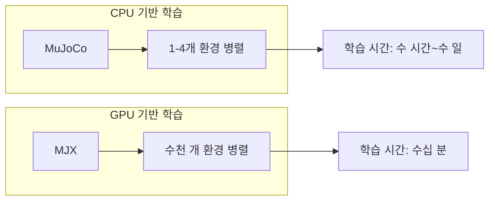

# Week 10: 휴머노이드 로봇 강화학습 (MuJoCo + MJX)

이번 주차에는 **Unitree G1 휴머노이드 로봇**을 MuJoCo 환경에서 강화학습으로 훈련시키는 방법을 학습합니다. Google DeepMind가 제공하는 **MuJoCo Menagerie**, **MJX (MuJoCo XLA)**, **MuJoCo Playground**를 활용합니다.

---

## 1. MuJoCo Menagerie 소개

### 1.1 MuJoCo Menagerie란?

**MuJoCo Menagerie**는 Google DeepMind가 관리하는 **고품질 로봇 모델 컬렉션**입니다. 다양한 로봇의 MJCF(MuJoCo XML) 파일을 제공하며, 강화학습 연구 및 시뮬레이션에 바로 활용할 수 있습니다.

**GitHub**: https://github.com/google-deepmind/mujoco_menagerie

**지원 로봇 유형:**

| 카테고리 | 대표 모델 |
| :--- | :--- |
| **Humanoids** | Unitree G1, Unitree H1, Berkeley Humanoid, Booster T1 |
| **Quadrupeds** | Unitree Go2, Anymal C, Boston Dynamics Spot |
| **Arms** | Franka FR3, KUKA iiwa, Universal Robots UR5e |
| **Hands** | Shadow Hand, LEAP Hand, Allegro Hand |
| **Drones** | Skydio X2, Crazyflie 2 |

### 1.2 Unitree G1 휴머노이드

**Unitree G1**은 Unitree Robotics에서 개발한 이족보행 휴머노이드 로봇입니다.

> [!IMPORTANT]
> Unitree G1 모델은 **MuJoCo 2.3.4 이상** 버전이 필요합니다.

**모델 URL**: https://github.com/google-deepmind/mujoco_menagerie/tree/main/unitree_g1

**제공 파일:**

| 파일 | 설명 |
| :--- | :--- |
| `g1.xml` | 기본 G1 모델 (29 DOF) |
| `g1_with_hands.xml` | 손 포함 G1 모델 |
| `scene.xml` | 바닥면, 조명 포함 씬 |
| `scene_mjx.xml` | **MJX용** GPU 가속 버전 |

### 1.3 설치 및 모델 로드

```bash
# MuJoCo 설치
uv add mujoco

# robot_descriptions 패키지 (권장)
uv add robot_descriptions

# 또는 직접 클론
git clone https://github.com/google-deepmind/mujoco_menagerie.git
```

#### 모델 로드 방법

```python
import mujoco

# 방법 1: robot_descriptions 패키지 사용
from robot_descriptions import unitree_g1_mj_description
model = mujoco.MjModel.from_xml_path(unitree_g1_mj_description.MJCF_PATH)

# 방법 2: 직접 경로 지정
model = mujoco.MjModel.from_xml_path("mujoco_menagerie/unitree_g1/scene.xml")
data = mujoco.MjData(model)

# 모델 정보 확인
print(f"관절 수: {model.nq}")
print(f"액추에이터 수: {model.nu}")
print(f"바디 수: {model.nbody}")
```

#### 시각화

```bash
# Python 뷰어로 모델 확인
python -m mujoco.viewer --mjcf mujoco_menagerie/unitree_g1/scene.xml
```

---

## 2. MJX (MuJoCo XLA)

### 2.1 MJX란?

**MJX**는 MuJoCo의 **JAX 기반 재구현**으로, GPU/TPU에서 대규모 병렬 시뮬레이션을 가능하게 합니다. 강화학습에서 수천 개의 환경을 동시에 실행해 학습 속도를 크게 향상시킵니다.



**지원 플랫폼:**
- NVIDIA/AMD GPU
- Apple Silicon (M1/M2/M3)
- Google Cloud TPUs

### 2.2 MJX 설치

```bash
# MJX 패키지 설치
uv add mujoco-mjx

# JAX GPU 버전 (CUDA 12)
uv add "jax[cuda12]"

```

### 2.3 MJX 기본 사용법

```python
import jax
import mujoco
from mujoco import mjx

# 1. MuJoCo 모델 로드
mj_model = mujoco.MjModel.from_xml_path("mujoco_menagerie/unitree_g1/scene_mjx.xml")

# 2. MJX 모델로 변환
mjx_model = mjx.put_model(mj_model)

# 3. 초기 데이터 생성
mjx_data = mjx.make_data(mjx_model)

# 4. JAX JIT 컴파일된 step 함수
@jax.jit
def step(mjx_model, mjx_data):
    return mjx.step(mjx_model, mjx_data)

# 5. 시뮬레이션 실행
for _ in range(1000):
    mjx_data = step(mjx_model, mjx_data)
```

### 2.4 배치 시뮬레이션 (병렬 환경)

```python
import jax
import jax.numpy as jnp
from mujoco import mjx

# 4096개 환경 병렬 실행
batch_size = 4096

# 배치용 데이터 생성
def make_batch_data(mjx_model, batch_size):
    data = mjx.make_data(mjx_model)
    # 배치 차원 추가
    return jax.tree.map(
        lambda x: jnp.stack([x] * batch_size), 
        data
    )

# 벡터화된 step 함수
@jax.jit
@jax.vmap
def batched_step(mjx_model, mjx_data, actions):
    mjx_data = mjx_data.replace(ctrl=actions)
    return mjx.step(mjx_model, mjx_data)

# 배치 시뮬레이션
batch_data = make_batch_data(mjx_model, batch_size)
random_actions = jax.random.uniform(
    jax.random.PRNGKey(0), 
    shape=(batch_size, mjx_model.nu),
    minval=-1, maxval=1
)
batch_data = batched_step(mjx_model, batch_data, random_actions)
```

---

## 3. MuJoCo Playground

### 3.1 MuJoCo Playground란?

**MuJoCo Playground**는 Google DeepMind에서 개발한 **GPU 가속 로봇 학습 프레임워크**입니다. MJX를 기반으로 다양한 로봇 환경과 강화학습 알고리즘을 통합 제공합니다.

**핵심 기능:**
- 즉시 사용 가능한 로봇 환경 (Humanoid, Quadruped, Manipulation)
- PPO 학습 스크립트 내장
- **Sim-to-Real** 전이 지원
- 실시간 학습 시각화

> [!TIP]
> Unitree G1 로봇은 **RTX 4090 2개**로 약 **30분 내** 보행 정책을 학습할 수 있습니다.

**웹사이트**: https://playground.mujoco.org/

### 3.2 설치

```bash
# PyPI에서 설치
uv add playground

# 또는 소스에서 설치 (권장 - 최신 기능)
git clone https://github.com/google-deepmind/mujoco_playground.git
cd mujoco_playground
uv pip install -e .

# JAX CUDA 지원
uv add "jax[cuda12]"
```

### 3.3 사용 가능한 환경

```python
# 환경 목록 확인
from playground import registry

# 모든 환경 출력
for env_name in registry.list_envs():
    print(env_name)
```

**주요 환경 (Humanoid):**
- `G1JoystickFlatTerrain` - G1 보행 (평지)
- `G1JoystickRoughTerrain` - G1 보행 (험지)
- `H1JoystickFlatTerrain` - H1 보행
- `BerkeleyHumanoidJoystickFlatTerrain` - Berkeley Humanoid

**주요 환경 (Quadruped):**
- `Go2JoystickFlatTerrain` - Go2 보행
- `AnymalCJoystickFlatTerrain` - Anymal C 보행

### 3.4 CLI로 학습 시작

```bash
# 기본 PPO 학습 (CartPole)
train-jax-ppo --env_name CartpoleBalance

# Unitree G1 학습
train-jax-ppo --env_name G1JoystickFlatTerrain

# MuJoCo Warp 백엔드 사용 (더 빠름)
train-jax-ppo --env_name G1JoystickFlatTerrain --impl warp
```

### 3.5 Python에서 학습

```python
# 10-1.py: MuJoCo Playground PPO Training
from playground import registry
from playground.config import Config
from playground.algorithms.ppo import PPO

# 환경 생성
env_name = "G1JoystickFlatTerrain"
env_config = registry.get_default_config(env_name)
env = registry.make(env_name, env_config)

# PPO 설정
ppo_config = Config(
    num_envs=4096,           # 병렬 환경 수
    num_steps=10,            # 업데이트당 스텝
    learning_rate=3e-4,
    gamma=0.99,
    gae_lambda=0.95,
    clip_eps=0.2,
    entropy_coef=0.01,
    total_timesteps=10_000_000,
)

# 학습 실행
ppo = PPO(env, ppo_config)
ppo.train()

# 모델 저장
ppo.save("g1_walking_policy.pkl")
```

---

## 4. Gymnasium 환경으로 래핑

### 4.1 MuJoCo Menagerie + Gymnasium

Stable-Baselines3 등 기존 RL 라이브러리와 호환을 위해 Gymnasium 환경으로 래핑할 수 있습니다.

```python
# 10-2.py: Custom G1 Gymnasium Environment
import gymnasium as gym
from gymnasium import spaces
import numpy as np
import mujoco
import mujoco.viewer

class UnitreeG1Env(gym.Env):
    """Unitree G1 휴머노이드 Gymnasium 환경"""
    
    metadata = {"render_modes": ["human", "rgb_array"], "render_fps": 60}
    
    def __init__(self, render_mode=None):
        super().__init__()
        
        # MuJoCo 모델 로드
        self.model = mujoco.MjModel.from_xml_path(
            "mujoco_menagerie/unitree_g1/scene.xml"
        )
        self.data = mujoco.MjData(self.model)
        
        # 관절 수
        self.n_joints = self.model.nu  # 액추에이터 수
        
        # Action Space: 관절 토크 (-1 ~ 1)
        self.action_space = spaces.Box(
            low=-1.0, high=1.0,
            shape=(self.n_joints,),
            dtype=np.float32
        )
        
        # Observation Space: [qpos, qvel, IMU]
        obs_dim = self.model.nq + self.model.nv + 6
        self.observation_space = spaces.Box(
            low=-np.inf, high=np.inf,
            shape=(obs_dim,),
            dtype=np.float32
        )
        
        self.render_mode = render_mode
        self.viewer = None
        self.max_steps = 1000
        self.current_step = 0
        
    def _get_obs(self):
        """관측값 반환"""
        qpos = self.data.qpos.copy()
        qvel = self.data.qvel.copy()
        
        # IMU 데이터 (가속도, 자이로)
        imu = np.zeros(6)
        if self.model.nsensor >= 6:
            imu = self.data.sensordata[:6].copy()
        
        return np.concatenate([qpos, qvel, imu]).astype(np.float32)
    
    def _get_info(self):
        """추가 정보"""
        # pelvis(골반) 높이
        pelvis_id = mujoco.mj_name2id(
            self.model, mujoco.mjtObj.mjOBJ_BODY, "pelvis"
        )
        pelvis_height = self.data.xpos[pelvis_id, 2]
        
        return {
            "step": self.current_step,
            "pelvis_height": pelvis_height,
        }
    
    def reset(self, seed=None, options=None):
        super().reset(seed=seed)
        
        mujoco.mj_resetData(self.model, self.data)
        
        # 초기 keyframe 적용 (서있는 자세)
        if self.model.nkey > 0:
            mujoco.mj_resetDataKeyframe(self.model, self.data, 0)
        
        self.current_step = 0
        return self._get_obs(), self._get_info()
    
    def step(self, action):
        # 토크 스케일링
        scaled_action = action * 50  # 최대 토크 50 Nm
        self.data.ctrl[:] = scaled_action
        
        # 물리 시뮬레이션 (여러 서브스텝)
        n_substeps = 4
        for _ in range(n_substeps):
            mujoco.mj_step(self.model, self.data)
        
        self.current_step += 1
        
        obs = self._get_obs()
        info = self._get_info()
        
        # 보상 계산
        reward = self._compute_reward(action)
        
        # 종료 조건
        terminated = self._is_terminated()
        truncated = self.current_step >= self.max_steps
        
        return obs, reward, terminated, truncated, info
    
    def _compute_reward(self, action):
        """보상 함수"""
        reward = 0.0
        
        # 1. 생존 보상
        reward += 1.0
        
        # 2. 전진 속도 보상
        forward_vel = self.data.qvel[0]  # x축 속도
        reward += 2.0 * forward_vel
        
        # 3. 높이 유지 보상
        pelvis_id = mujoco.mj_name2id(
            self.model, mujoco.mjtObj.mjOBJ_BODY, "pelvis"
        )
        height = self.data.xpos[pelvis_id, 2]
        target_height = 0.75  # G1 서있는 높이
        height_error = abs(height - target_height)
        reward += np.exp(-5 * height_error)
        
        # 4. 에너지 효율 패널티
        energy = np.sum(np.abs(action * self.data.qvel[:len(action)]))
        reward -= 0.001 * energy
        
        return reward
    
    def _is_terminated(self):
        """종료 조건"""
        pelvis_id = mujoco.mj_name2id(
            self.model, mujoco.mjtObj.mjOBJ_BODY, "pelvis"
        )
        height = self.data.xpos[pelvis_id, 2]
        
        # 넘어지면 종료
        if height < 0.3:
            return True
        
        return False
    
    def render(self):
        if self.render_mode == "human":
            if self.viewer is None:
                self.viewer = mujoco.viewer.launch_passive(
                    self.model, self.data
                )
            self.viewer.sync()
    
    def close(self):
        if self.viewer is not None:
            self.viewer.close()
            self.viewer = None


# 테스트
if __name__ == "__main__":
    env = UnitreeG1Env(render_mode="human")
    obs, info = env.reset()
    
    print(f"Observation shape: {obs.shape}")
    print(f"Action space: {env.action_space}")
    
    for _ in range(500):
        action = env.action_space.sample()
        obs, reward, terminated, truncated, info = env.step(action)
        env.render()
        
        if terminated or truncated:
            obs, info = env.reset()
    
    env.close()
```

### 4.2 Stable-Baselines3로 학습

```python
# 10-3.py: SB3 PPO Training for Unitree G1
from stable_baselines3 import PPO
from stable_baselines3.common.vec_env import DummyVecEnv, VecNormalize
from stable_baselines3.common.callbacks import EvalCallback, CheckpointCallback
from stable_baselines3.common.monitor import Monitor

# 환경 생성 함수
def make_env():
    def _init():
        env = UnitreeG1Env()
        env = Monitor(env)
        return env
    return _init

# 병렬 환경
n_envs = 4
env = DummyVecEnv([make_env() for _ in range(n_envs)])
env = VecNormalize(env, norm_obs=True, norm_reward=True)

# PPO 모델
model = PPO(
    "MlpPolicy",
    env,
    learning_rate=3e-4,
    n_steps=2048,
    batch_size=64,
    n_epochs=10,
    gamma=0.99,
    gae_lambda=0.95,
    clip_range=0.2,
    ent_coef=0.01,
    tensorboard_log="./logs/g1_ppo/",
    verbose=1,
    device="auto",
)

# 콜백
eval_callback = EvalCallback(
    DummyVecEnv([make_env()]),
    best_model_save_path="./models/g1_best/",
    eval_freq=10000,
    n_eval_episodes=5,
)

checkpoint_callback = CheckpointCallback(
    save_freq=50000,
    save_path="./models/g1_checkpoints/",
)

# 학습
model.learn(
    total_timesteps=1_000_000,
    callback=[eval_callback, checkpoint_callback],
    progress_bar=True,
)

# 저장
model.save("./models/g1_ppo_final")
env.save("./models/g1_vec_normalize.pkl")
```

---

## 5. Reward Shaping for Humanoid

### 5.1 휴머노이드 보상 설계 가이드

휴머노이드 로봇의 보행 학습에는 세심한 보상 함수 설계가 필수입니다.

```python
# 10-4.py: Humanoid Reward Shaping
import numpy as np

class HumanoidRewardShaper:
    """휴머노이드 로봇용 보상 함수 설계"""
    
    def __init__(self):
        # 목표 값
        self.target_height = 0.75      # 서있는 골반 높이
        self.target_velocity = 1.0     # 목표 전진 속도 (m/s)
        
        # 가중치
        self.weights = {
            "alive": 0.5,           # 생존 보상
            "forward_vel": 2.0,     # 전진 속도
            "height": 1.0,          # 높이 유지
            "orientation": 1.0,     # 자세 안정성
            "foot_contact": 0.5,    # 발 접촉 패턴
            "energy": -0.001,       # 에너지 효율
            "action_smooth": -0.01, # 행동 부드러움
        }
        
        self.prev_action = None
    
    def compute_reward(self, model, data, action):
        """복합 보상 계산"""
        rewards = {}
        
        # 1. 생존 보상
        rewards["alive"] = self.weights["alive"]
        
        # 2. 전진 속도 보상
        forward_vel = data.qvel[0]
        vel_error = abs(forward_vel - self.target_velocity)
        rewards["forward_vel"] = self.weights["forward_vel"] * np.exp(-vel_error)
        
        # 3. 높이 유지
        pelvis_id = mujoco.mj_name2id(model, mujoco.mjtObj.mjOBJ_BODY, "pelvis")
        height = data.xpos[pelvis_id, 2]
        height_error = abs(height - self.target_height)
        rewards["height"] = self.weights["height"] * np.exp(-3 * height_error)
        
        # 4. 자세 안정성 (roll, pitch 최소화)
        quat = data.xquat[pelvis_id]
        roll = np.arctan2(2*(quat[0]*quat[1] + quat[2]*quat[3]),
                         1 - 2*(quat[1]**2 + quat[2]**2))
        pitch = np.arcsin(np.clip(2*(quat[0]*quat[2] - quat[3]*quat[1]), -1, 1))
        orientation_error = roll**2 + pitch**2
        rewards["orientation"] = self.weights["orientation"] * np.exp(-2 * orientation_error)
        
        # 5. 발 접촉 패턴 (번갈아 접촉하면 보상)
        # 왼발, 오른발 접촉 센서 확인
        n_left_contact = self._count_contacts(model, data, "left_foot")
        n_right_contact = self._count_contacts(model, data, "right_foot")
        
        if n_left_contact > 0 and n_right_contact > 0:
            rewards["foot_contact"] = self.weights["foot_contact"] * 0.5  # 양발 착지
        elif n_left_contact > 0 or n_right_contact > 0:
            rewards["foot_contact"] = self.weights["foot_contact"]  # 한 발 착지
        else:
            rewards["foot_contact"] = 0.0  # 공중
        
        # 6. 에너지 효율
        power = np.sum(np.abs(action * data.qvel[:len(action)]))
        rewards["energy"] = self.weights["energy"] * power
        
        # 7. 행동 부드러움
        if self.prev_action is not None:
            action_diff = np.sum((action - self.prev_action)**2)
            rewards["action_smooth"] = self.weights["action_smooth"] * action_diff
        else:
            rewards["action_smooth"] = 0.0
        self.prev_action = action.copy()
        
        # 총 보상
        total_reward = sum(rewards.values())
        
        return total_reward, rewards
    
    def _count_contacts(self, model, data, body_name):
        """특정 바디의 접촉 수 계산"""
        body_id = mujoco.mj_name2id(model, mujoco.mjtObj.mjOBJ_BODY, body_name)
        count = 0
        for i in range(data.ncon):
            contact = data.contact[i]
            geom1_body = model.geom_bodyid[contact.geom1]
            geom2_body = model.geom_bodyid[contact.geom2]
            if geom1_body == body_id or geom2_body == body_id:
                count += 1
        return count
```

### 5.2 보상 구성 요소 정리

| 보상 항목 | 목적 | 가중치 범위 |
| :--- | :--- | :--- |
| **생존 (Alive)** | 넘어지지 않고 버티기 | +0.1 ~ +1.0 |
| **전진 속도 (Forward Velocity)** | 목표 속도로 이동 | +1.0 ~ +3.0 |
| **높이 유지 (Height)** | 서있는 자세 유지 | +0.5 ~ +1.5 |
| **자세 안정 (Orientation)** | Roll/Pitch 최소화 | +0.5 ~ +1.5 |
| **발 접촉 (Foot Contact)** | 걷기 패턴 유도 | +0.3 ~ +0.8 |
| **에너지 효율 (Energy)** | 토크 사용량 최소화 | -0.001 ~ -0.01 |
| **행동 부드러움 (Smoothness)** | 급격한 행동 변화 방지 | -0.01 ~ -0.1 |

---

## 6. 학습 및 평가 파이프라인

### 6.1 완전한 학습 스크립트

```bash
# 필수 패키지 설치
uv add mujoco mujoco-mjx "jax[cuda12]"
uv add gymnasium stable-baselines3 tensorboard

# Playground 설치 (선택)
uv add playground
```

### 6.2 TensorBoard 모니터링

```bash
# 학습 로그 확인
tensorboard --logdir=./logs/

# 브라우저에서 http://localhost:6006 접속
```

**모니터링 지표:**
- `rollout/ep_rew_mean` - 에피소드 평균 보상
- `rollout/ep_len_mean` - 에피소드 평균 길이
- `train/policy_loss` - 정책 손실
- `train/value_loss` - 가치 함수 손실

### 6.3 학습된 모델 평가

```python
# 10-5.py: Evaluate Trained Model
from stable_baselines3 import PPO
from stable_baselines3.common.vec_env import DummyVecEnv, VecNormalize

def evaluate(model_path, n_episodes=10):
    # 환경 로드
    env = DummyVecEnv([lambda: UnitreeG1Env(render_mode="human")])
    env = VecNormalize.load("./models/g1_vec_normalize.pkl", env)
    env.training = False
    
    # 모델 로드
    model = PPO.load(model_path, env=env)
    
    for episode in range(n_episodes):
        obs = env.reset()
        total_reward = 0
        done = False
        
        while not done:
            action, _ = model.predict(obs, deterministic=True)
            obs, reward, done, info = env.step(action)
            total_reward += reward[0]
        
        print(f"Episode {episode + 1}: Reward = {total_reward:.2f}")
    
    env.close()

if __name__ == "__main__":
    evaluate("./models/g1_best/best_model.zip")
```

---

## 7. Sim-to-Real 전이 준비

### 7.1 Domain Randomization

실제 로봇으로 전이하기 위해 시뮬레이션에서 다양한 변형을 적용합니다.

```python
# 10-6.py: Domain Randomization
class DomainRandomizer:
    """시뮬레이션 환경 변형"""
    
    def __init__(self, model):
        self.model = model
        self.default_friction = model.geom_friction.copy()
        self.default_mass = model.body_mass.copy()
    
    def randomize(self, rng):
        """환경 파라미터 랜덤화"""
        
        # 1. 마찰 계수 (±30%)
        friction_scale = rng.uniform(0.7, 1.3)
        self.model.geom_friction[:] = self.default_friction * friction_scale
        
        # 2. 링크 질량 (±20%)
        mass_scale = rng.uniform(0.8, 1.2, size=self.model.nbody)
        self.model.body_mass[:] = self.default_mass * mass_scale
        
        # 3. 외부 교란력
        external_force = rng.uniform(-10, 10, size=3)  # N
        
        return {
            "friction_scale": friction_scale,
            "mass_scale": mass_scale,
            "external_force": external_force,
        }
    
    def reset(self):
        """기본값으로 복원"""
        self.model.geom_friction[:] = self.default_friction
        self.model.body_mass[:] = self.default_mass
```

### 7.2 체크리스트

> [!IMPORTANT]
> **Sim-to-Real 성공을 위한 체크리스트:**
> 1. ✅ Domain Randomization 적용
> 2. ✅ 관측값 노이즈 추가 (센서 노이즈 모사)
> 3. ✅ 행동 지연 추가 (통신 지연 모사)
> 4. ✅ 제어 주파수 매칭 (시뮬레이션 ↔ 실제 로봇)
> 5. ✅ 정규화 통계 저장 (`VecNormalize.save()`)

---

## 8. 요약

| 구성요소 | 도구 | 용도 |
| :--- | :--- | :--- |
| **로봇 모델** | MuJoCo Menagerie | 고품질 MJCF 모델 제공 |
| **GPU 시뮬레이션** | MJX (MuJoCo XLA) | JAX 기반 대규모 병렬 시뮬레이션 |
| **RL 프레임워크** | MuJoCo Playground | 통합 학습 환경 + PPO |
| **래핑** | Gymnasium | SB3 등 라이브러리 호환 |
| **학습 알고리즘** | PPO | 안정적인 정책 최적화 |

---

## 참고 자료

- **MuJoCo Menagerie**: https://github.com/google-deepmind/mujoco_menagerie
- **Unitree G1 모델**: https://github.com/google-deepmind/mujoco_menagerie/tree/main/unitree_g1
- **MuJoCo MJX 문서**: https://mujoco.readthedocs.io/en/stable/mjx.html
- **MuJoCo Playground**: https://github.com/google-deepmind/mujoco_playground
- **MuJoCo Playground 논문**: https://arxiv.org/abs/2502.08844
- **Unitree RL Gym**: https://github.com/unitreerobotics/unitree_rl_gym
