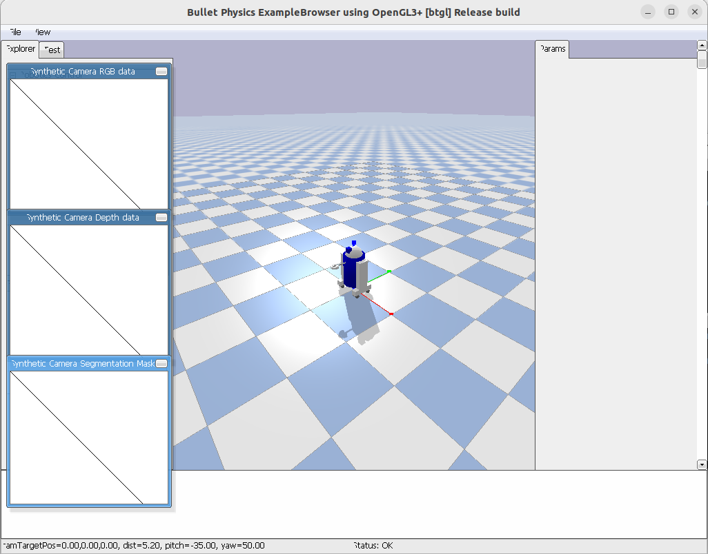
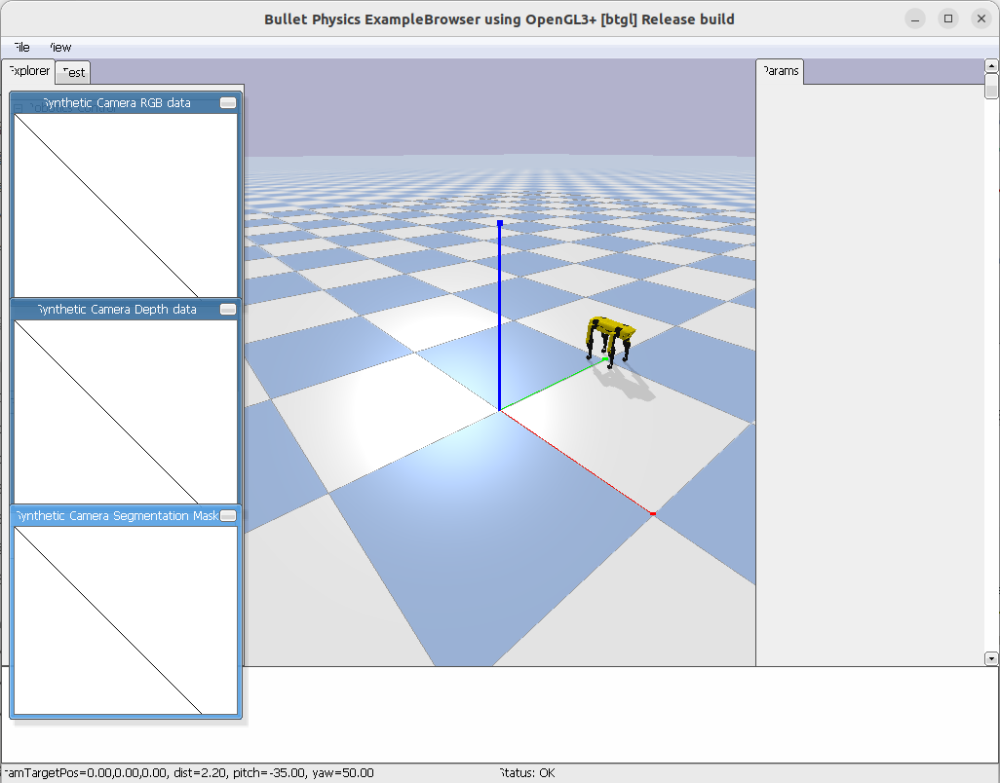
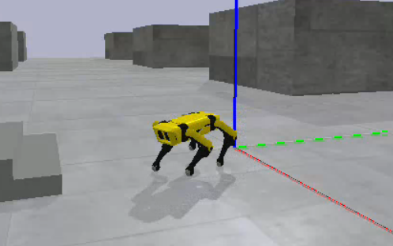

- 간단하게 월드에서 로봇 생성하기
/micro_spot/SpotMicroJetson/Simulation/pybullet_tutorial/pybullet_basic.py 실행  
내용 설명 

필요 패키지 불러오기

```python
import pybullet as p
import time
import pybullet_data
```

`p.connect(p.GUI)`: 시뮬레이션 서버에 연결 

```python

physicsClient = p.connect(p.GUI)
```

`setAdditionalSearchPath`: 로봇 모델(URDF 파일 등)이 저장된 기본 경로를 지정

`setGravity(0, 0, -9.8)`: 지구의 중력 가속도를 설정

`setTimeStep`: 시뮬레이션이 한 번의 연산을 수행할 때 물리적으로 얼마만큼의 시간이 흘렀다고 가정할지 정함. 값이 작을수록 시뮬레이션이 정확해진다.

`p.loadURDF("plane.urdf")`: urdf 불러오기

```python
p.setAdditionalSearchPath(pybullet_data.getDataPath())
p.setGravity(0, 0, -9.8)

# You can set how many seconds to update once 
# you update in a physical simulation.
p.setTimeStep(1/200)

#urdf 파일 가져오기 
planeID = p.loadURDF("plane.urdf")
```

 `p.getQuaternionFromEuler` : 오일러각을 쿼터니안으로 변경

이제 초기스폰위치 pos와 ori 설정, 로봇 urdf 가져오기 

```python
cubeStartPos = [0, 0, 0.5]
cubeStartOrientation = p.getQuaternionFromEuler([0, 0, 3.14])
# The loadURDF function can also set the location and rotation state.
# Rotation status is changed from oiler angle to quarterian format on next line
# because it receives a quarterionic factor.
robotID = p.loadURDF("r2d2.urdf", cubeStartPos, cubeStartOrientation)

for i in range(10000):
    p.stepSimulation()
    time.sleep(1 / 200)

p.disconnect(physicsClient)
```



- 로봇개로 초기위치 변경해서 생성해보기

Simultation/basic.py 생성

cubeStartPos (0,1,0.2)로 이동 

p.loadURDF에서 urdf 파일 "../urdf/spotmicroai_gen.urdf.xml"으로 변경 

(파란색:z축,녹색:y축,빨간색:x축)

```python
cubeStartPos = [0, 1, 0.2]
cubeStartOrientation = p.getQuaternionFromEuler([0, 0, 3.14])
robotID = p.loadURDF("../urdf/spotmicroai_gen.urdf.xml", cubeStartPos, cubeStartOrientatio
```



- 사륜구동로봇에 joint 정보를 알아내고 조인트와 속도를 gui로 조절하기

/micro_spot/SpotMicroJetson/Simulation/pybullet_tutorial/pybullet_simplecar.py 실행

`p.getNumJoints` : 로봇 관절의 총 갯수를 반환

`p.getJointInfo` :( `urdf_id`, `joint_num`) 2개의 매개변수를 받으며 특정 인덱스에 대한 정보를 

튜플로 반환

`p.addUserDebugParameter` : (`paramName`, `rangeMin`,`rangeMax`,`startValue`):

이 함수는 생성하려는 UI 요소의 종류(주로 슬라이더)와 범위를 지정합니다.

반환값은 새로 생성된 디버그 매개변수의 고유 ID

param에 Steering(앞바퀴 angle 조절)과 Throttle(속도조절) 파라미터 생성

```python
angle = p.addUserDebugParameter('Steering', -0.5, 0.5, 0)
throttle = p.addUserDebugParameter('Throttle', -5, 5, 0)
car = p.loadURDF('simplecar.urdf', [0, 0, 0.1])
number_of_joints = p.getNumJoints(car)
for joint_number in range(number_of_joints):
    # This prints out all the information returned by getJointInfo().
    # Try it out
    info = p.getJointInfo(car, joint_number)
    print(info[0], ": ", info[1])
plane = p.loadURDF('plane.urdf')    
```

원하는 joint의 값 얻기, 터미널에서 joint ID 뜸 


`p.readUserDebugParameter` : (`paramUniqueId` )한개의 매개변수를 받으며 슬라이더, 버튼, 텍스트 입력창과 같은 UI 요소를 화면에 추가할 수 있습니다

`p.setJointMotorControl2` : (`bodyUniqueId` ,`jointIndex`, `controlMode` )필수 3개의 파라미터를 받으며

지정된 관절에 모터 제어 명령을 보냅니다 

`controlMode` 는 ****어떤 방식으로 관절을 제어할지 지정합니다.
`controlMode` 종류: p.POSITION_CONTROL,p.VELOCITY_CONTROL,p.TORQUE_CONTROL

```python
wheel_indices = [1, 3, 4, 5]
hinge_indices = [0, 2]

while True:
    user_angle = p.readUserDebugParameter(angle)
    user_throttle = p.readUserDebugParameter(throttle)
    for joint_index in wheel_indices:
        # This allows us to change the velocity, position, 
        # or apply a torque to a joint. 
        # This is the main method used to control robots. 
        # It takes both a robot ID and a joint ID
        p.setJointMotorControl2(car, joint_index,
                                p.VELOCITY_CONTROL,
                                targetVelocity=user_throttle)
    for joint_index in hinge_indices:
        p.setJointMotorControl2(car, joint_index,
                                p.POSITION_CONTROL, 
                                targetPosition=user_angle)
    p.stepSimulation()

p.disconnect(physicsClient)

```


- 돌아가서 /micro_spot/SpotMicroJetson/Simulation/pybullet_basic.py 실행


사족보행 `param` 설명 

`Kp` : p gain 비례 이득 (Proportional Gain)

로봇의 **현재 위치**와 **목표 위치** 사이의 오차에 비례하여 관절 모터에 가하는 힘의 크기 결정.
`Kd` : d gain 미분 이득 (Derivative Gain)

로봇 관절의 **속도 오차** 또는 움직이는 속도에 비례하여 힘을 가함

`MaxForce`: 관절 모터가 최대로 낼 수 있는 힘 또는 토크의 상한선임

`height`: 로봇의 전체적인 높이

아래 4개는 막아두었음

`spur front` : 앞다리의 가로폭

`spur rear` :  뒷다리의 가로 폭

`step length` : 전후 제어값

`step width` : 좌우 제어값

`step alpha` : 회전 제어값

`step height` : 걸음의 높이

t0, t1, t2, t3

`front Offset` : 앞다리들의 위치

`rear Offset` : 뒷다리들의 위치 

**문제1 :** 여러 파라미터를 조정했으나 로봇이 안움직임  

sudo /home/ehdtod001009/micro_spot/oroca/bin/python3 pybullet_automatic_gait.py 

관리자 권한을 부여야해야함 안그러면 터미널에서 키가 안먹임

**문제2 :** 로봇이 중력이 적용이 안되는 것마냥 떠있음 

useFixedBase=False로 설정해야하는데 True로 설정해서 생긴 문제이다.

robot=spotmicroai.Robot(False,True,reset) 로 변경하기 

t1,t2,t3,t4 조절하기
