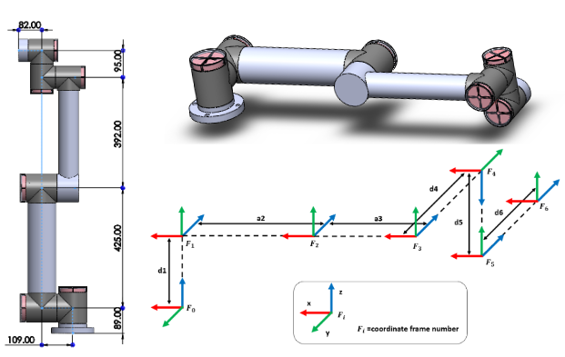
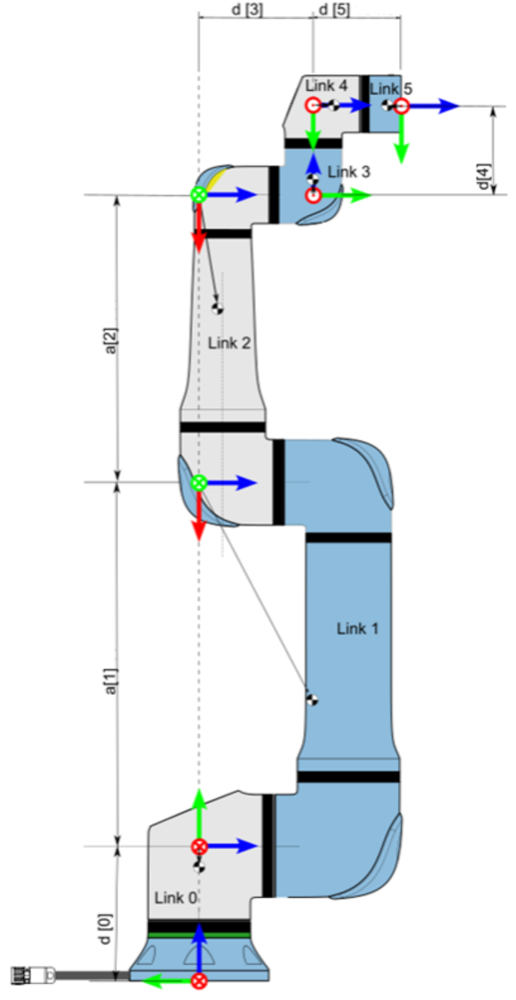
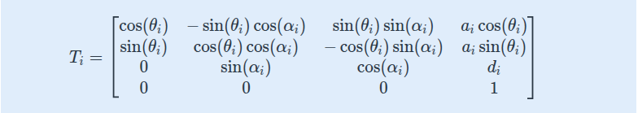
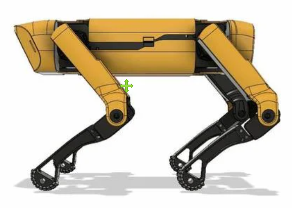

**정기구학,DH 파라미터의 정의**

- 정기구학의 개념과 적용방법

`정기구학`: "관절의 각도를 알 때, 로봇 끝단(발끝)의 위치가 어디인가?"를 계산하는 과정

`DH 파라미터`:로봇의 각 Joint와 Link들을 수학적으로 모델링하기 위한 매개변수이다.

DH parameter 설정하는 규칙만 준수한다면, 각 좌표들의 위치와 방향은 설계자가 자유롭게 설정하면 됨(규칙만 준수하면 결국 해는 모두 같게 나옴)
규칙
- 각 관절의 회전축을 $z$ 축으로 좌표계 선정
- 각 링크에 연결된 관절의 회전축이 서로 직각이 되게 $x$ 축 선정
- $x_{i-1}$ 축에 대한 회전( $z_i$ 통일)
- $x_{i-1}$ 축에 대한 이동
- $z_{i}$ 축에 대한 이동
- $z_{i}$ 축에 대한 회전( $x_i$ 통일)




* $\theta_i$: $z_i$축을 기준으로 $x_i$에서 $x_{i+1}$까지의 회전 각도 (조인트 회전 각)
* $d_i$: $z_i$축을 따라 $x_i$와 $x_{i+1}$ 사이 거리 (링크 오프셋)  
  (z축의 화살표 방향으로 이동하면 **+**, 반대 방향으로 이동하면 **-**)
* $a_i$: $x_i$축을 따라 $z_i$와 $z_{i+1}$ 사이 거리 (링크 길이)  
  (항상 양수(+)로 잡는 것이 관례입니다.)
* $\alpha_i$: $x_i$축을 기준으로 $z_i$에서 $z_{i+1}$까지의 회전 각도 (링크 뒤틀림 각)


| Joint | θ (degrees) | d (m) | a (m) | α (degrees) |
| --- | --- | --- | --- | --- |
| 1 | 0 | 0.089 | 0 | pi / 2 |
| 2 | 0 | 0 | -0.425 | 0 |
| 3 | 0 | 0 | -0.392 | 0 |
| 4 | 0 | 0.109 | 0 | pi / 2 |
| 5 | 0 | 0.095 | 0 | - pi / 2 |
| 6 | 0 | 0.082 | 0 | 0 |

<aside>
변환행렬 ($T_i​ $)

정기구학(Forward Kinematics)
6자유도 경우,변환행렬을 이런식으로 곱해서 로봇의 끝단위치를 구할 수 있다. 


**SpotMicro 정기구학 코드 분석** 

</aside>

예시로 사족주행 로봇의 경우, 몸체(Base)를 기준

각 다리의 고관절(Hip), 무릎(Knee), 발목(Ankle) 각도를 입력

출력은 발끝(End-effector)이 3차원 공간상의 어느 좌표 (x, y, z)에 있는지를 찾아내는 수학적 함수

먼저 정기구학을 적용하기 위해서는 **자유도**를 알아야한다.

`자유도`(DOF, Degrees of Freedom): 로봇이 공간에서 얼마나 독립적으로 움직일 수 있는지를 

나타내는 숫자이다

사족보행 로봇은 **"자유도 수 = 모터의 개수"** 이므로 **12 자유도**를 의미한다 

하지만 12개를 한꺼번에 계산하면 너무 복잡하기 때문에 
일단 다리 하나(3자유도)만 파악해보자



| **joint** | **θi (회전)** | **di (오프셋)** | **ai (길이)** | **αi (비틀림)** |
| --- | --- | --- | --- | --- |
| **1** |  |  |  |  |
| **2** |  |  |  |  |
| **3** |  |  |  |  |

micro_spot/SpotMicroJetson/Simulation/kinematics.py 파일에 가기

```
    다리의 링크 길이
    self.l1 = 50   # Hip offset
    self.l2 = 20   # Shoulder length
    self.l3 = 100  # Upper leg (Thigh)
    self.l4 = 100  # Lower leg (Shank)
```

```python
    #kinematics.py leg 한다리 계산 
    def calcLegPoints(self,angles):
        (l1,l2,l3,l4)=(self.l1,self.l2,self.l3,self.l4)
        (theta1,theta2,theta3)=angles
        theta23=theta2+theta3

        T0=np.array([0,0,0,1])
        T1=T0+np.array([-l1*cos(theta1),l1*sin(theta1),0,0])
        T2=T1+np.array([-l2*sin(theta1),-l2*cos(theta1),0,0])
        T3=T2+np.array([-l3*sin(theta1)*cos(theta2),-l3*cos(theta1)*cos(theta2),l3*sin(theta2),0])
        T4=T3+np.array([-l4*sin(theta1)*cos(theta23),-l4*cos(theta1)*cos(theta23),l4*sin(theta23),0])
            
        return np.array([T0,T1,T2,T3,T4])
```

calcLegPoints는 DH 파라미터 적용한 T0,T1,T2,T3,T4를 반환한다
