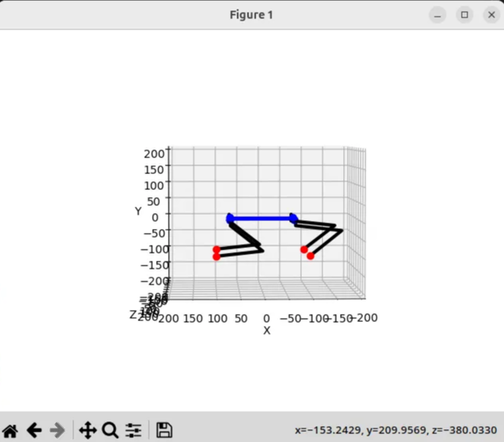
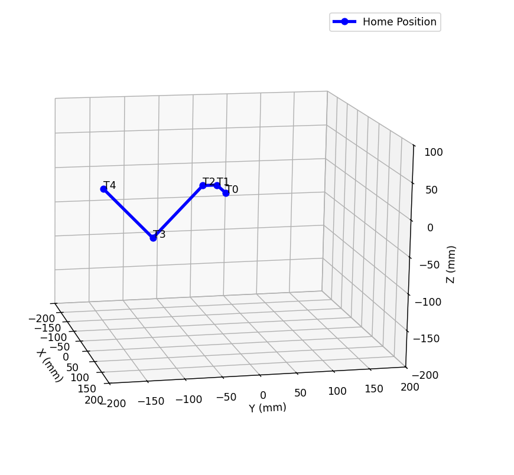
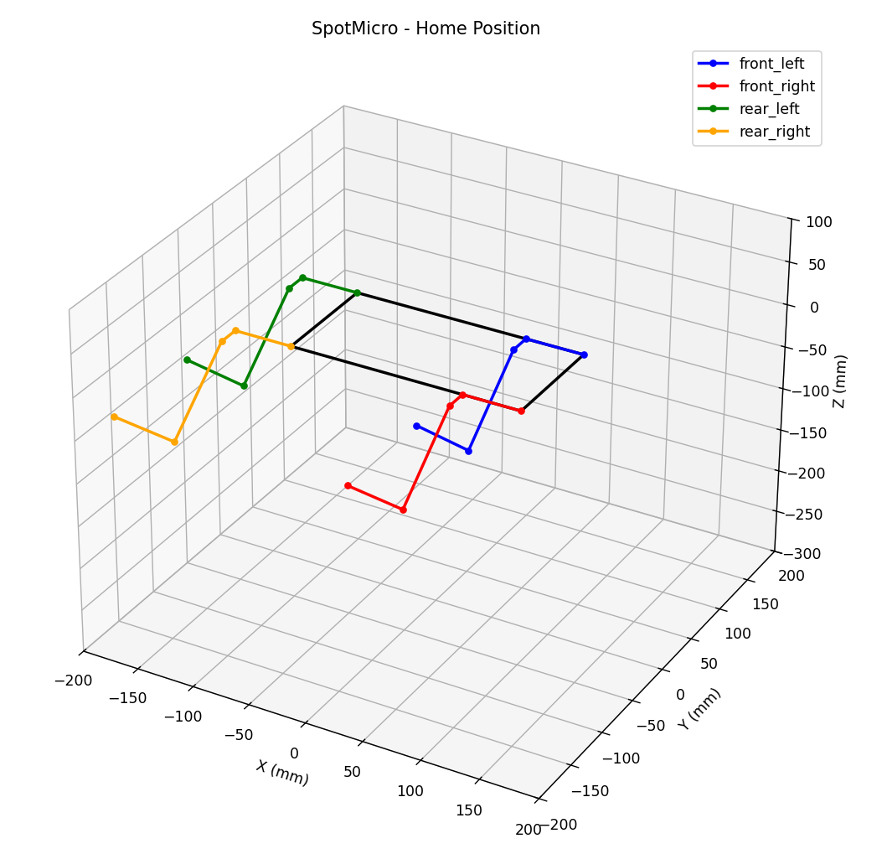
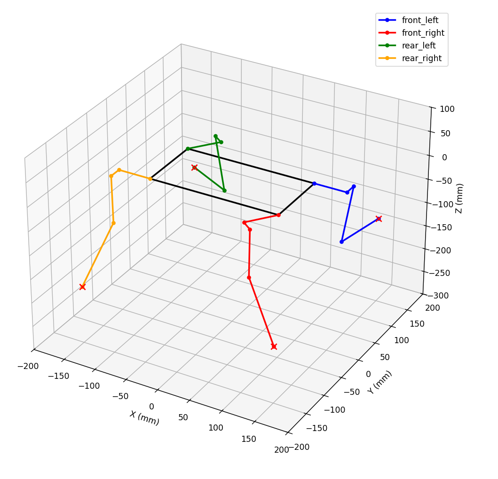
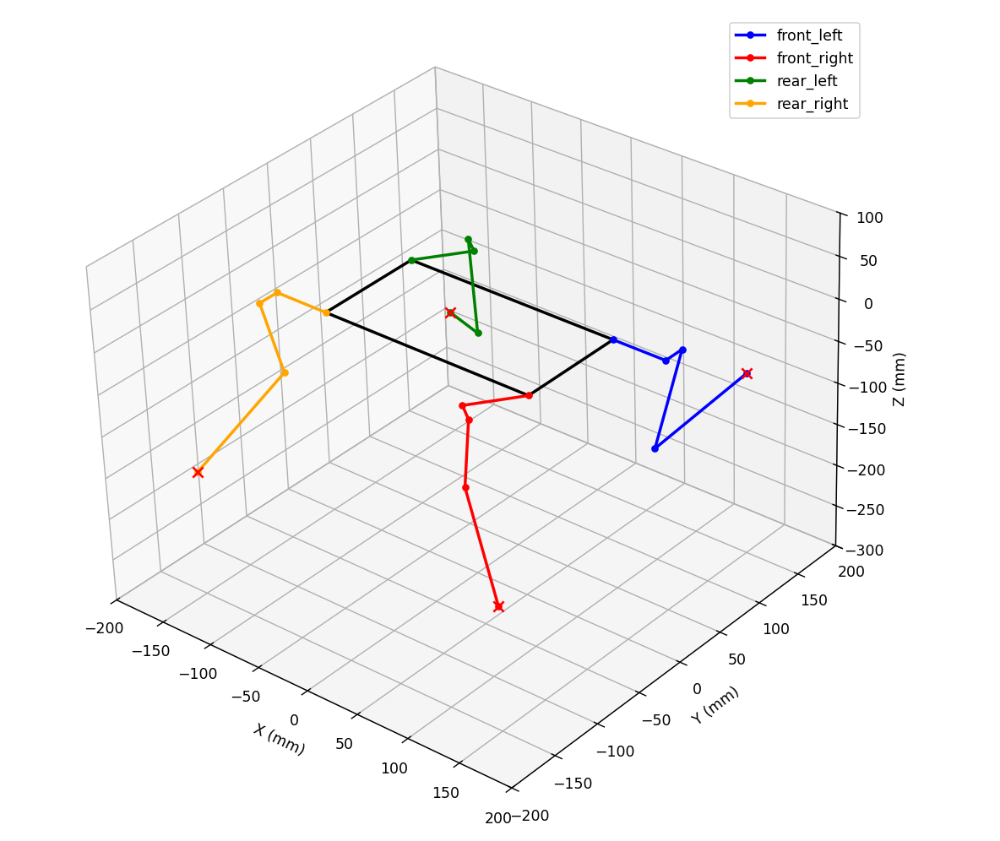

# 
코드 분석 
### **1.주요 클래스**: `Kinematic`

**로봇 규격 (`__init__`)**:
• `l1, l2, l3, l4`: 로봇 다리 한 개의 각 분절(Link) 길이입니다. (예: 어깨, 허벅지, 종아리 등)
• `L, W`: 로봇 몸체의 길이(Length)와 너비(Width)입니다.

• `thetas` = np.array([[0, 0, 0],[0, 0, 0],[0, 0, 0],[0, 0, 0]], dtype=np.float64),12개의 조인트 

**몸체 역기구학 (`bodyIK`)**:
• 로봇 몸체의 회전(Roll, Pitch, Yaw)과 중심 이동(x, y, z)을 입력받아 **4개의 어깨 관절이 있어야 할 좌표**를 계산합니다.
• 회전 행렬(Rx, Ry, Rz)을 사용하여 몸체의 움직임을 계산합니다.

**다리 역기구학 (`legIK`)**:
• 가장 중요한 부분으로, 발 끝의 목표 좌표(x, y, z)를 입력하면 세 개의 관절 각도(`theta1, theta2, theta3`)를 계산합니다.
• 삼각함수(atan2, acos, sqrt)를 사용하여 기하학적으로 해를 구합니다.

**다리 포인트 계산 (`calcLegPoints`)**:
• 계산된 각도들을 가지고 실제 다리 관절들이 공간상 어디에 위치하는지 좌표로 변환합니다. (시각화용)

### 2. 시각화 및 실행 함수

로봇의 상태를 화면에 그리는 역할을 합니다.

• **`setupView`**: 3D 그래프의 축 범위와 라벨을 설정합니다.

• **`drawRobot`**: 몸체와 4개의 다리를 동시에 그립니다.

• **`drawLegPair`**: 왼쪽과 오른쪽 다리의 대칭성을 고려하여 다리 모양을 그립니다.

• **`initIK`**: 역기구학 시뮬레이션을 시작하는 함수입니다. 발 끝 위치(`Lp`)를 입력받아 로봇 모양을 출력하고 각 관절 각도를 반환합니다.

## 2.발끝 점으로 joint 값 추출하기



```html
    # 초기 다리의 끝점을 의미
    Lp=np.array([[100,-100,100,1], \
                [100,-100,-100,1], \
                [-100,-100,100,1], \
                [-100,-100,-100,1]])
		
```

Lp[0][0] 100→200으로 수정한다.


```html
    # 초기 다리의 끝점을 의미
    Lp=np.array([[200,-100,100,1], \
                [100,-100,-100,1], \
                [-100,-100,100,1], \
                [-100,-100,-100,1]])
		
```

initFK 함수 활용하여 joint값 출력

```python
if __name__=="__main__":
    theta = initIK(Lp)
    print(theta)
```

radian 단위로 출력 

```html
# Forward Kinematics 
[[ 0.12074282  0.3084707   1.34722609]
 [ 0.12074282 -0.76094302  2.18742449]
 [ 0.12074282 -1.42648147  2.18742449]
 [ 0.12074282 -1.42648147  2.18742449]]

```

## **Matplotlib로 로봇 다리 시각화**

Forward Kinematics로 계산된 관절 위치(T0~T4)를 연결하여 다리를 그립니다.

/home/ehdtod001009/micro_spot/SpotMicroJetson/Simulation/matlab_leg.py 실행

한 발의 링크길이

```python
        # 링크 길이 (mm)
        self.l1 = 50   # Shoulder offset
        self.l2 = 20   # Shoulder length
        self.l3 = 100  # Upper leg
        self.l4 = 115  # Lower leg
        self.L = 140
        self.W = 75
```

주의) 몸체길이랑 다리길이 체크 

단위 

링크 길이 (mm)

목표 발끝 위치 (mm)

관절 각도 (radians)

# T0: 기준점

# T1: Shoulder 관절

# T2: Leg 관절

# T3: Foot 관절

# T4: 발끝

정기구학으로 한 발 그림 



## **4개 다리 동시 시각화**

/home/ehdtod001009/micro_spot/SpotMicroJetson/Simulation/matlab_4leg_v.py

/home/ehdtod001009/micro_spot/SpotMicroJetson/Simulation/matlab_4leg_s.py

#몸통 기준점으로 사용 

```python
# 각 다리의 기준점 위치 (몸통 기준)
self.leg_positions = {
        'front_left':  np.array([self.body_length/2, self.body_width/2, 0]),
        'front_right': np.array([self.body_length/2, -self.body_width/2, 0]),
        'rear_left':   np.array([-self.body_length/2, self.body_width/2, 0]),
        'rear_right':  np.array([-self.body_length/2, -self.body_width/2, 0])
        }
```

기본자세



기울기



한발 들어올리기 



## **발끝 궤적 설계**

traj_gen = TrajectoryGenerator(center=(100, -100, -150), radius=30, height_offset=20)

traj_gen.plot_trajectory(duration=2.0)

**원형 궤적**

### 1. `center` (중심점): "다리의 기본 자세"

로봇이 서 있을 때 발끝이 위치하는 기준점입니다. `(100, -100, -150)`은 몸체 중심에서 앞(X)으로 100mm, 옆(Y)으로 -100mm, 아래(Z)로 -150mm 떨어진 곳에 발을 두겠다는 뜻입니다.

- **정하는 법:**
    - **Z (높이):** 다리를 쭉 폈을 때의 길이보다 **약 70~80% 정도 짧게** 잡습니다. 다리를 완전히 다 펴면(`singular`) 제어가 안 되기 때문입니다.
    - **X, Y (폭):** 로봇이 안정적으로 서 있을 수 있도록 몸체 밖으로 적당히 벌려줍니다.

### 2. `radius` (반지름): "보폭의 절반"

원형 궤적에서 반지름은 발이 앞뒤로 움직이는 크기를 결정합니다.

- **정하는 법:**
    - 로봇이 한 걸음에 얼마나 멀리 갈지를 생각하세요.
    - 보폭(Stride)이 60mm라면 반지름은 30mm가 됩니다.
    - **주의점:** 반지름이 너무 크면 발이 이동 중에 몸체와 부딪히거나, 다리가 닿지 않는 영역(Dead zone)으로 나가버릴 수 있습니다.

### 3. `height_offset` (높이 오프셋): "발을 얼마나 높이 들 것인가"

로봇이 걸을 때 발이 바닥에 걸리지 않도록 들어 올리는 높이입니다.

- **정하는 법:**
    - **바닥이 평평할 때:** 약 10~20mm 정도면 충분합니다.
    - **장애물이 있을 때:** 장애물보다 높게 설정해야 합니다.
    - **주의점:** 너무 높게 들면 로봇의 무게 중심이 흔들려 불안정해질 수 있습니다.

/home/ehdtod001009/micro_spot/SpotMicroJetson/Simulation/matlab_circle.py 실행하기


**타원궤적**

/home/ehdtod001009/micro_spot/SpotMicroJetson/Simulation/matlab_elit.py 실행하기


다리 기준 위치 center

지면: z=-150 - -90 까지 60mm 발을 높임 height_offset에 의해서 조절가능
