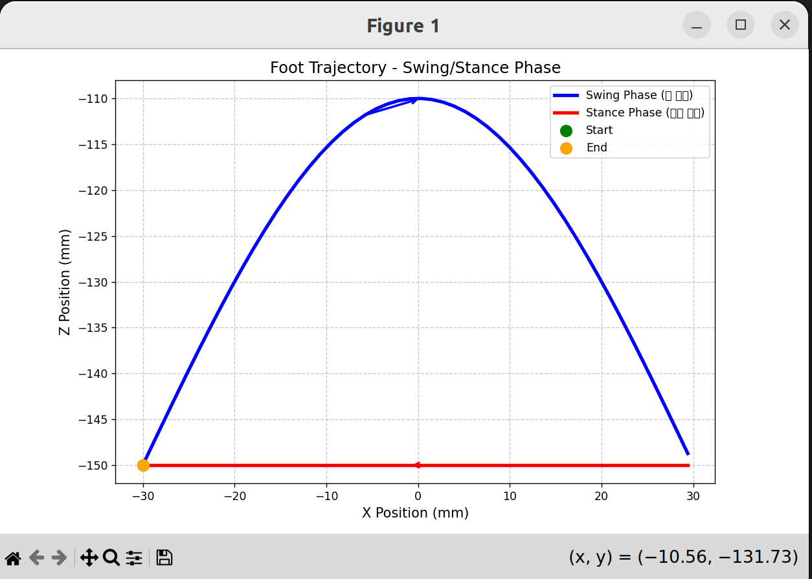
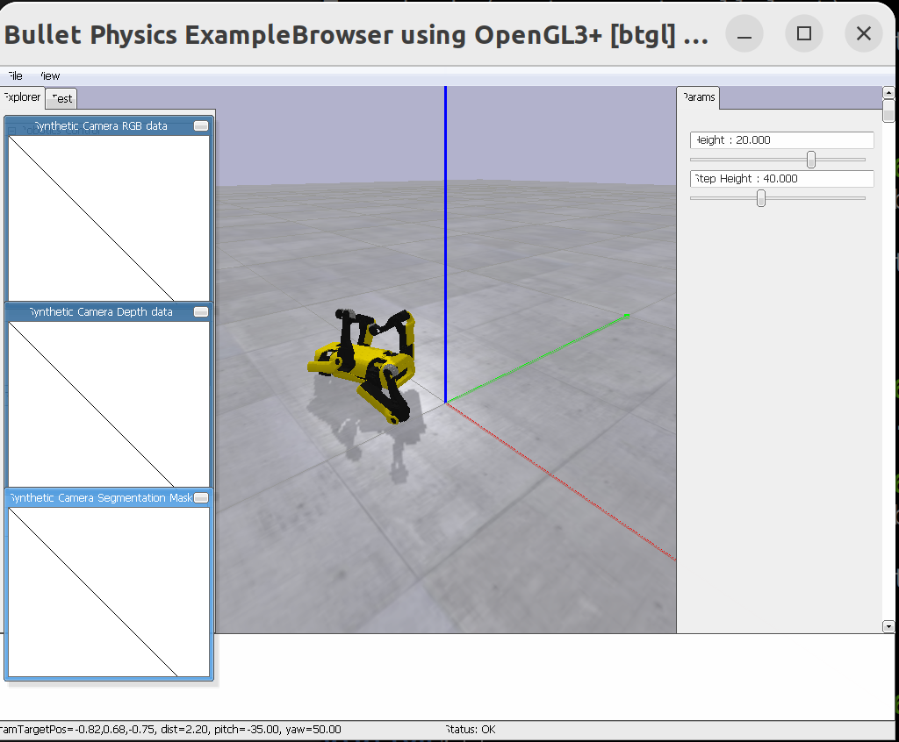

# 7주차:**Trot Gait 패턴과 제자리 걷기 구현**

## **1.1 4족 보행 로봇의 Gait 종류**

4족 보행 로봇에는 다양한 보행 패턴(Gait)이 있습니다:

| **Gait 종류** | **특징** | **속도** | **안정성** |
| --- | --- | --- | --- |
| **Walk** | 한 번에 한 발만 들음 | 느림 | 매우 높음 |
| **Trot** | 대각선 다리 쌍이 함께 움직임 | 중간 | 높음 |
| **Pace** | 같은 쪽 다리가 함께 움직임 | 중간 | 중간 |
| **Gallop** | 앞다리와 뒷다리가 따로 움직임 | 빠름 | 낮음 |
|  |  |  |  |

**Swing Phase (스윙 상)**

- 발을 들어올려 앞으로 이동
- 발끝이 공중에 있음
- 일반적으로 타원 또는 반원 궤적

**Stance Phase (지지 상)**

- 발이 지면에 닿아 있음
- 몸체를 앞으로 밀어주는 역할
- 직선 궤적 (지면 위에서)

대각선으로 다리가 번갈아가면서 swing과 stance 를 반복한다.

### **Swing/Stance 궤적 시각화 및 분석**

/home/ehdtod001009/micro_spot/SpotMicroJetson/Simulation/matlab_trot.py

FootTrajectory(step_length=60, step_height=40, ground_height=-150) 으로 시각화 

지면 -150 기준으로 잡고 발끝 궤적을 이미지로 표현 

swing은 반원 stance는 지면 높이 유지한체로 x만 움직인다. 

### **`Kinematics/kinematicMotion.py`에 있는 TrottingGait 클래스를 분석**

TrottingGait는 4개의 상태(state)를 순환

지면 대기 → 지면 밀기 →지면 대기 →  회전
`calcLeg(self, t, x, y, z)` : 시간 t에서 다리의 발끝 위치를 계산
4가지 상태에 따라 발끝점(x,y,z) 반환

`positions(self, t, kb_offset={})`

:시간 t에서 4개 다리의 발끝 위치를 계산

t : float 현재 시간

kd_offset : dict로 실시간 보폭 조절 가능

## **4.2 PyBullet 시뮬레이션**

/home/ehdtod001009/micro_spot/SpotMicroJetson/Simulation/pybullet_walking.py 실행하기 

trot walking에서 보폭이 0인 상태

**문제**: 자꾸 넘어짐 

height_slider 랑 step_height_slider 조절해보기  —> 실패 

분석: 일단 다리 움직임이 제대로 작동하는 것 같아 보이지는 않음 

print(leg_name, foot_pos)로 일단 좌표 확인하기 

<aside>

y축이 변함 제자리 걸음이라면 x그대로 z가 변환해야한다.

FR [ 120. -100.  -87.    1.]
RL [ -50. -100.   77.    1.]
RR [ -50. -100.  -77.    1.]
FL [ 120. -100.   87.    1.]
FR [120.         -97.33043237 -87.           1.        ]
RL [-50.         -97.33043237  77.           1.        ]
RR [ -50. -100.  -77.    1.]
FL [ 120. -100.   87.    1.]

</aside>
