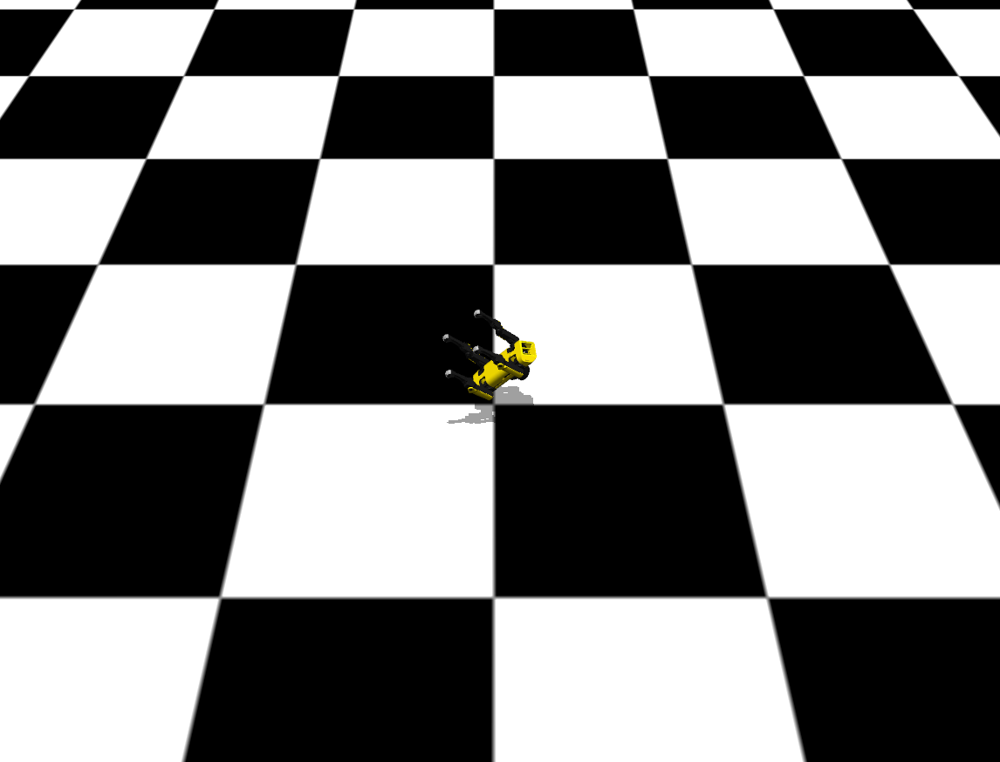
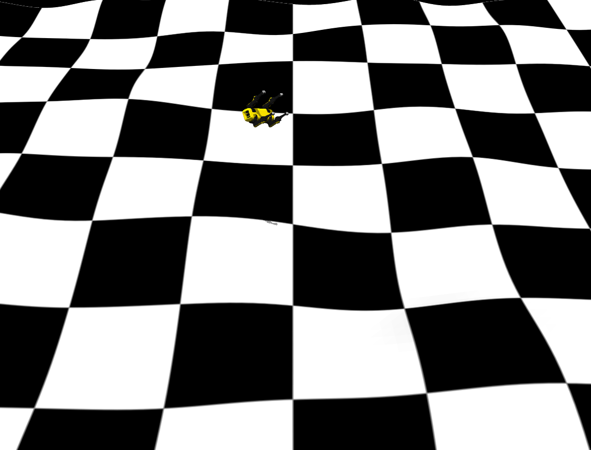
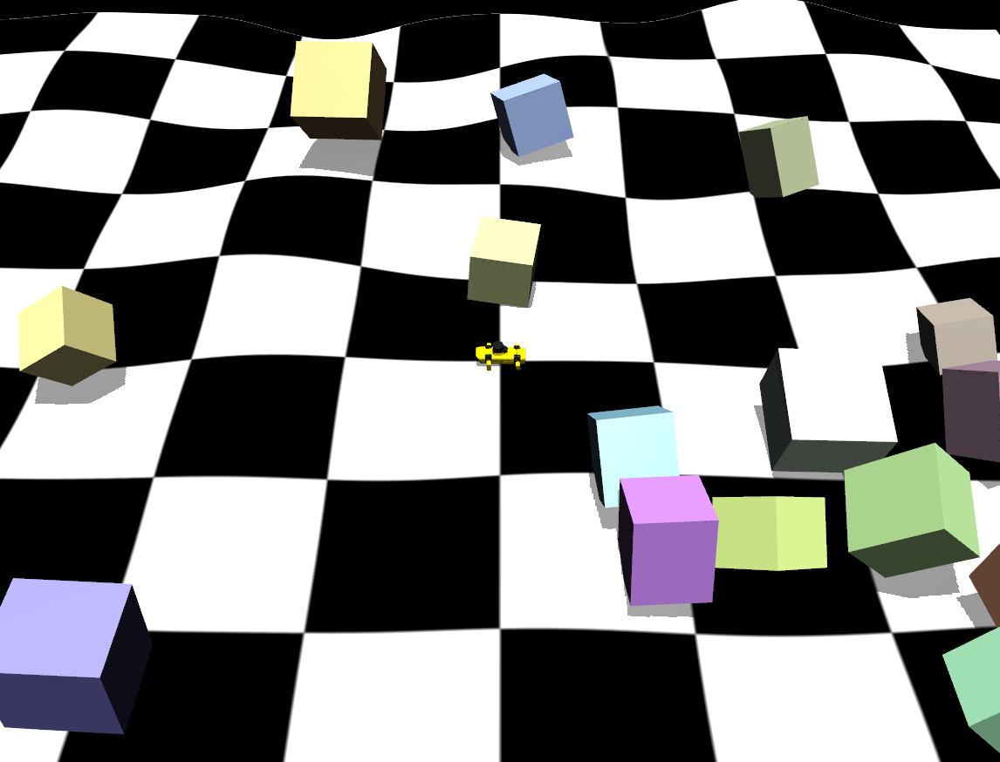

참고자료 : https://positive-impactor.tistory.com/553#google_vignette

## **currriculum learning 개념**
쉬움 / 중간 / 어려움 환경을 항상 섞어 두고 학습이 진행될수록 ‘어려움’의 비율을 점점 늘리는 방식

1.복잡한 환경(계단, 장애물, 불규칙 지형)을 생성
2.curriculum learning을 적용합니다.
평지 → 아주 약한 불규칙 → 장애물(박스랜덤배치)

1.3개의 환경구성
1. 평지에서 실행 (완)
2. 약간 불규칙한 지형에서 실행 (완)
3. 장애물 있는 환경 생성 (완)

```python
  def _generate_random_boxes_xml(self, num_boxes=15, area_size=3.0):
        """박스들을 정의하는 XML 문자열 조각을 생성합니다."""
        boxes_xml = ""
        for i in range(num_boxes):
            # 랜덤 위치 및 크기 설정
            x = np.random.uniform(-area_size, area_size)
            y = np.random.uniform(-area_size, area_size)
            z = 0.5  # 지면 위에 배치
            size = np.random.uniform(0.2, 0.15, size=3) # 가로, 세로, 높이 랜덤
            
            # 박스 하나하나를 body로 추가 (rgba는 랜덤 색상)
            rgba = np.append(np.random.uniform(0.5, 1.0, size=3), 1.0)
            rgba_str = ' '.join(map(str, rgba))
            size_str = ' '.join(map(str, size))
            
            boxes_xml += f"""
            <body name="box_{i}" pos="{x} {y} {z}">
                <freejoint name="joint_box_{i}"/>
                <geom name="geom_box_{i}" type="box" size="{size_str}" rgba="{rgba_str}" friction="0.8"/>
            </body>
            """
        return boxes_xml
        
               
  def _randomize_terrain(self):
        
        nrow = self.model.hfield_nrow[0]
        ncol = self.model.hfield_ncol[0]
        
        noise = np.random.uniform(0, 1, size=(nrow, ncol)).astype(np.float32)
        noise = gaussian_filter(noise, sigma=5.5) # 부드럽게 뭉개기
        
        # 0~1 사이로 다시 정규화 (문서 가이드 준수)
        noise = (noise - noise.min()) / (noise.max() - noise.min())

        # 3. mjModel의 hfield_data에 복사 (MuJoCo는 1차원 배열로 데이터를 관리함)
        start_idx = self.model.hfield_adr[0]
        self.model.hfield_data[start_idx : start_idx + (nrow * ncol)] = noise.flatten()

        if hasattr(mujoco, 'mjr_uploadHField'):
             # 렌더링 컨텍스트가 있을 경우 hfield를 다시 업로드해야 화면에 보입니다.
             pass
```

stage1



stage2



stage3



<aside>

</aside>

1. 각 환경의 비율을 나눠서 적용하기 
문제: 자꾸 로봇이 땅에 박혀서 생성

self.env_ratio = {1:[0.7,0.25,0.05],2:[0.4,0.2,0.2],3:[0.2,0.3,0.5]} 비율정함 

일단 1,2 stage 돌리기 0.9 , 0.1 확률로 돌리기 시도
