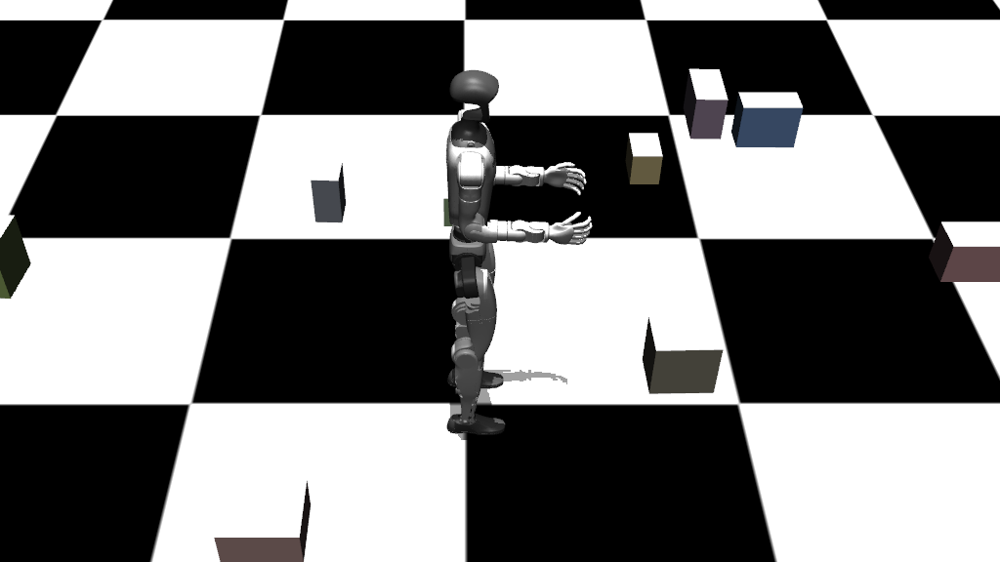

11주차 : 이족 -사족 비교 
unitree-g1 사용


사족보행이랑 똑같은 PPO 모델 설계, 같은 파라미터 적용

관절 조인트 변경

self.n_joints = 29 → observation, joint 설정

obs 설정 바꾸기 
terminated 조건 바꾸기

```
 def _get_obs(self):
        """현재 관측값 반환"""
        joint_pos = self.data.qpos[7:7+self.n_joints].copy()
        joint_vel = self.data.qvel[6:6+self.n_joints].copy()
        
 def _is_terminated(self):
        """종료 조건 확인"""
        body_height = self.data.xpos[1, 2]
        return body_height < 0.3  # 너무 낮으면 넘어진 것으로 판단     
```

1. 먼저 서있는거 시도 

보상설계

몸체로부터 z축 방향 , 높이 유지

```
    z
    ↑
    |
   [■]  ← pelvis
    |
    o------→ x
    
    q ≈ [1, 0, 0, 0] 항상 유지 
   
```

넘어질 때 패널티 

[Screencast from 02-09-2026 03:03:51 PM.webm](attachment:050f7cb2-8e4d-437f-a5bd-f2f49a981475:Screencast_from_02-09-2026_030351_PM.webm)

문제: 전진 기능 추가했으나 발바닥을 밀면서 감 

발이 땅에 닿아 있을 때  속도 ≈ 0 유지
공중에 있을 때 발속도 > 0

함수 추가 — 발의 지면 접촉여부 , 각 발의 속도 

```python
    # 발이 지면에 붙어 있을 때 -> True
    def foot_in_contact(self,foot_gid):
        ground_geom_id = self.model.geom('ground').id
        for i in range(self.data.ncon):
            c = self.data.contact[i]
            if ((c.geom1 == foot_gid and c.geom2 == ground_geom_id) or
                (c.geom2 == foot_gid and c.geom1 == ground_geom_id)):
                return True
        return False
    
    def get_site_linvel(self, site_id):
        vel = np.zeros(6)
        mujoco.mj_objectVelocity(
            self.model,
            self.data,
            mujoco.mjtObj.mjOBJ_SITE,
            site_id,
            vel,
            0
        )
        return vel[:3]   # linear velocity
    
```

```python
    def _compute_reward(self):
        """보상 함수 (기본 버전)"""
        
        reward = 0.5
        target_velocity = 0.6
        x_velocity = self.data.qvel[0]

        energy_waste = np.sum(np.square(self.data.actuator_force))
        reward -= 0.0000023 * energy_waste         
        
        # 상체(pelvis 또는 torso_link)의 쿼터니언 가져오기 -- stand 유지 보상
        # qpos[3:7]은 보통 Root(Pelvis)의 쿼터니언 [w, x, y, z]입니다.
        quat = self.data.qpos[3:7]
        torso_id = mujoco.mj_name2id(self.model, mujoco.mjtObj.mjOBJ_BODY, "pelvis")
        up_vector = self.data.xmat[torso_id][6:9]  # 회전 행렬의 마지막 행이 z축 방향 벡터

        upright_value = up_vector[2] 
        upright_reward = np.exp(-5.0 * (1.0 - upright_value)**2)
        reward += 1.5 * upright_reward        
        
        # 전진 보상 
        target_velocity = 0.7
        if x_velocity > 0:
            speed_reward = np.clip(np.exp(-3.0 * (x_velocity - target_velocity)**2),0,1)
        else:
            speed_reward = 0.0
        
        # 발 미는 행동 억제 
        foot_drag_penalty = 0.0
        foots_vel  = []
        for site_name in ['left_foot', 'right_foot']:
            site_id = self.model.site(site_name).id
            foot_vel = np.linalg.norm(self.get_site_linvel(site_id))
            # 접촉했을 때 속도 = 0 X --> 패널티 
            if self.foot_in_contact(site_id):                
                if foot_vel > 0:
                    foot_drag_penalty -= 1
            else:
                if foot_vel == 0:
                    foot_drag_penalty -= 1        
 
        reward += 1.2 * foot_drag_penalty + 3 * speed_reward      
                
        body_height = self.data.xpos[1, 2]        
        if body_height < 0.4:
            reward -= 20.0   

        return reward
```

사족 보행 - 이족보행 공통점 /차이점 
## **사족보행로봇**

- 보통 2~3발 접촉
- 넓은 지지 다각형 (support polygon)
- 외력이 조금 이상해도 다른 발들이 바로 보정

## 휴머로이드

- **발로 밀기 ❌**
- **COM을 앞으로 떨어뜨림** ⭕

```python
COM → (중력)
       ↓
발은 그냥 받쳐줌
```

| 항목 | 사족보행 | 이족보행 |
| --- | --- | --- |
| 전진 보상 | ✅ | ✅ |
| 토크 패널티 | ✅ | ✅ |
| 발 끌기 방지 | ✅ | ✅ |
| 발높이 보상(속도x) | ✅  | ✅  |
| 중심잡기  | 수평보상 |  몸체 수직 회전 |
| 다리 보상(추가) | 대각선 일치  | COM- 발 이용 |

