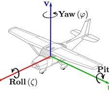

# 12주차 : 마무리

모델설계

```python
# 2. PPO 모델 설정
model = PPO(
    policy="MlpPolicy",  # Multi-Layer Perceptron
    env=env,
    learning_rate=3e-4,
    n_steps=2048,        # 업데이트당 스텝 수
    batch_size=64,
    n_epochs=10,         # 데이터 재사용 횟수
    gamma=0.99,          # 할인율
    gae_lambda=0.95,     # GAE 파라미터
    clip_range=0.2,      # PPO Clipping 범위
    ent_coef=0.01,       # 엔트로피 보너스 (탐색 장려)
    vf_coef=0.5,         # Value function 손실 계수
    max_grad_norm=0.5,   # Gradient clipping
    tensorboard_log="./logs/ppo_spotmicro/",
    verbose=1,
    device="auto",       # CUDA 자동 감지
)
    
```

생존보상 reward = 0.5 default



roll과 pitch를 활용하여 보상을 안정적으로 준다

안정적일때 +점수를 준다

전진보상 

x가 바뀌면 플러스 

trot는:

- 왼쪽 앞발 + 오른쪽 뒷발 (LF + RH)
- 오른쪽 앞발 + 왼쪽 뒷발 (RF + LH)

대각선 A가 접촉 ,대각선 B는 비접촉 → 그 순간 보너스 지급

발끝 높이를 높이 올리는 거 방지하기 위해서 접촉안할시 목표 넓이에 도달하면 +을 준다 

```python
target_velocity = 0.7
velocity_x = self.data.qvel[0]
foot_geom_names = ['FL', 'FR', 'RL', 'RR']
foot_body_names = ['front_left_foot_link', 'front_right_foot_link', 'rear_left_foot_link', 'rear_right_foot_link']

foot_geom_ids = [self.model.geom(name).id for name in foot_geom_names]
foot_body_ids = [self.model.body(name).id for name in foot_body_names]
foot_height = [self.data.xpos[i][2] for i in foot_body_ids]
foot_contacts = self.foot_in_contact(foot_geom_ids)

# 전진 보행 + 대각선 발 contact 인 경우 
is_trot = (foot_contacts[0] == foot_contacts[2]) != (foot_contacts[1]== foot_contacts[3])
trot_reward = 0.0   
if velocity_x > 0:            
    speed_reward = 9 * np.clip(np.exp(-3.0 * (velocity_x - target_velocity)**2),0,1)
    if is_trot:
        trot_reward = 1               
else:
    speed_reward = 0

reward += speed_reward + trot_reward
        
# 발끝이 공중에 있을 때(Contact == False) 목표 높이에 근접하면 보상, trot
target_swing_height = 0.063
index = 0
height_error = 0
swing_reward = 0
for foot_contact in foot_contacts:
    index = 0
    if not foot_contact:                  
        height_error += np.square(foot_height[index] - target_swing_height)              
        swing_reward += 0.5 * np.exp(-height_error / 0.01)                        
    index += 1                       

reward += swing_reward
```

발끌림을 방지하기 위해서 접촉시 속도 > 0이면 패널티 

```python
# 발끌림 방지
vx,vy,_,contact_force = self.get_foot_vel(foot_body_ids)
if contact_force > 1.0: 
  slipspeed_reward = 0.5 * np.sqrt(vx**2 + vy**2)
  reward -= slipspeed_reward       
```

발떨림을 방지하기 위해서 에너지 패널티주기 

```python
energy_waste = np.sum(np.square(self.data.actuator_force))
reward -= 0.00015 * energy_waste       
```

body 기준 높이유지 보상 (0.20-0.23)
